# UX Design Specification — Anime-Sama Downloader v1.0

**Author:** Guilhem
**Date:** 31 janvier 2026
**Design Era:** Sakura Night™

---

## Executive Summary

### Project Vision

**Anime-Sama Downloader v1.0** est une refonte complète d'une application de téléchargement d'animes. L'objectif est de transformer une interface "désastreuse" en une application **moderne, intuitive et visuellement inspirée par l'esthétique anime/manga**.

**Problème à résoudre** :
- Interface confuse et austère (années 2000)
- UX complex pour télécharger un épisode
- Aucune identité visuelle anime
- Pas d'automatisation (subscriptions, sync AniList)

**Vision cible** :
- Télécharger un anime en **3 clics** pour les casual users
- Automatisation complète pour power users
- Identité visuelle forte : **"Sakura Night"** (minimalisme moderne + esthétique anime)

### Target Users

**1. Alex le Casual Fan 🍿** (22-28 ans, étudiant/jeune dev)
- Veut télécharger les derniers épisodes **rapidement**
- Compétences basiques (Docker, pas plus)
- Frustration clé : "Pourquoi c'est si confus et moche ?"
- **Besoin UX** : 3 clics, feedback clair, interface engageante

**2. Maya la Jellyfin Power User 📚** (28-40 ans, DevOps/SysAdmin)
- Veut **automatiser** (AniList sync → Jellyfin)
- Compétences avancées (Linux, APIs, webhooks)
- Frustration clé : "Pourquoi pas d'automatisation complète ?"
- **Besoin UX** : Mode expert, APIs, webhooks, monitoring

### Key Design Challenges

1. **Simplifier sans sacrifier la puissance**
   - Alex a besoin de "3 clics"
   - Maya a besoin de "mode expert complet"
   - Solution : Dashboard pour Alex + Mode avancé pour Maya

2. **Clarifier les choix d'anime complexes**
   - Plusieurs saisons, VF/VOSTFR, groupes de sous-titres
   - Frustration actuelle : "Lequel choisir ?"
   - Solution : Preview metadata, filtres explicites, labels clairs

3. **Feedback temps-réel sur les downloads**
   - Actuellement : confusion sur statut job
   - Solution : Progress bars animées + SSE streaming + notifications

4. **Intégration Jellyfin sans douleur**
   - Maya veut metadata correcte + naming strategy
   - Solution : Webhooks + auto-naming conforme Jellyfin

### Design Opportunities

1. **Dashboard "Nouveautés" personnalisé**
   - Card visuelle "Jujutsu Kaisen S2 Ep12 disponible"
   - Engagement vs. interface austère actuelle

2. **One-click subscriptions**
   - AniList sync → subscriptions auto
   - Scheduler configurable
   - Game changer pour Maya
   - **Note** : Phase 2 (Growth), pas MVP

3. **Micro-interactions animées**
   - Progress bars fluides + pétales sakura subtils
   - Rendre le téléchargement *satisfying*
   - Créer une expérience mémorable

---

## Core User Experience

### Defining Experience

**Phase 1 MVP Strategy** : Deux expériences adaptées dans une seule interface, sans calendrier.

**Action Core pour Alex 🍿** : Rechercher un anime → Télécharger → Suivre progression
- Doit être **< 30 secondes** et **≤ 3 clics**
- Interface épurée, minimaliste, sans bruit
- Feedback immédiat sur chaque action

**Action Core pour Maya 📚** : Configurer webhooks Jellyfin → Automatiser downloads → Monitorer queue
- Doit être **complètement robuste** avec logs accessibles
- Dashboard expert avec stats en temps réel
- API REST pour intégrations custom

### Platform Strategy

- **Platform primaire** : Web SPA (React + TypeScript)
- **Responsiveness** : Desktop prioritaire, mobile acceptable (responsive)
- **Real-time requirements** : SSE pour streaming job progress, webhooks pour Jellyfin
- **Offline** : Non nécessaire (dépend Internet pour scraping anime-sama.si)
- **CLI** : Phase 2+ (commandes allégées via API)

### Effortless Interactions

**Pour Alex (Mode Simple)** :
- ✨ Tapez titre → suggestions autocomplete instantanées (< 100ms)
- ✨ Cliquez anime → métadonnées explicites (saison, épisode, langue)
- ✨ Cliquez "Télécharger" → confirmation + ajout à queue visible
- ✨ Progress bar fluide avec ETA + notification quand prêt

**Pour Maya (Mode Expert)** :
- ✨ Toggle "Power User Mode" → Dashboard enrichi (onglets Stats, Logs, Webhooks)
- ✨ Configure Jellyfin webhook une fois → fonctionne automatiquement après
- ✨ Logs structurés filtrables par anime/status/date
- ✨ Webhooks testables avec "Send Test Event"

### Critical Success Moments

1. **Premier téléchargement (Alex)** 
   - Moment : "Je clique télécharger et je vois du feedback IMMÉDIATEMENT"
   - Risque d'échec : silence radio → utilise autre app
   - Solution : toast "Ajouté à la queue" + progress bar immédiatement visible

2. **Clarification choix d'anime complexes**
   - Moment : "Je sélectionne la bonne saison/langue sans ambiguïté"
   - Risque d'échec : mauvais choix → download inutile → frustration
   - Solution : labels explicites, preview metadata, confirmation avant télécharger

3. **Error Transparency**
   - Moment : "Quand quelque chose échoue, je comprends pourquoi"
   - Risque d'échec : erreur silencieuse → utilisateur croit que ça marche
   - Solution : toast d'erreur clair + logs détaillés pour Maya, simplifié pour Alex

4. **Jellyfin Integration Setup (Maya)**
   - Moment : "Je configure webhooks, c'est prêt en 5 minutes"
   - Risque d'échec : wizard confus → abandonne = script custom
   - Solution : wizard pas-à-pas avec test button

5. **Mode Toggle Seamless**
   - Moment : "Je switch en Mode Expert, tout reste accessible"
   - Risque d'échec : toggle casse les states → page blank
   - Solution : persistence localStorage, state consistency tests

### Experience Principles

**Basé sur 3 méthodes avancées (Focus Group, Debate, War Room)** :

1. **Clarté avant pouvoir** ✅
   - Choix d'anime complexes = labels explicites + preview
   - Jamais d'ambiguïté (VOSTFR vs VF vs saison)
   - Mode Simple reste simple, Mode Expert reste accessible

2. **Feedback immédiat + Error Transparency** 🔴 **CRITIQUE**
   - Chaque action utilisateur = réponse visuelle dans 200ms
   - **Les erreurs ne sont JAMAIS silencieuses**
   - Alex : messages simples ("Download failed, retrying in 5min")
   - Maya : logs full stack pour debugger

3. **Power User Mode Toggle (Architecture Pattern)**
   - Menu Settings → toggle "Power User Mode" (default OFF)
   - Quand ON : onglets Webhooks/Logs/Stats apparaissent
   - Alex ne clique jamais dessus = voit jamais la complexité
   - Maya active une fois = reste en mode expert
   - Persistence localStorage + state consistency

4. **Deux expériences, une codebase (Zustand + Composition)**
   - Pas de duplication massive (code partagé 40%, variants 35%, distinct 25%)
   - Architecture : Zustand stores + composants simple/expert séparés
   - Maintenance claire, testing parallèle possible
   - Timeline : ~27 jours (5-6 sprints)

5. **Esthétique & fonction (Sakura Night)**
   - Palette magenta/cyan + dark mode = engagement visuel
   - Priorité pour Alex (casual engagement)
   - Maya accepte du moment que c'est usable

6. **Jellyfin Integration sans douleur**
   - Wizard onboarding pour webhooks (pas de doc manual)
   - Naming strategy documentée + auto-validée
   - Test button pour vérifier connection
   - Support multiples versions Jellyfin (10.8, 10.9, 10.10)

### Scoping Note

**Phase 1 MVP** (sans) :
- ❌ Calendrier airing schedule
- ❌ Subscriptions auto + scheduler
- ❌ AniList sync bidirectionnel
- ❌ Mobile app native
- ❌ Multi-users RBAC avancé

**Phase 1 MVP** (avec) :
- ✅ Mode Simple (Alex) : recherche + download + queue + notifications
- ✅ Mode Expert (Maya) : webhooks Jellyfin + logs + stats + settings avancés
- ✅ Error handling transparent
- ✅ Sakura Night design system
- ✅ SSE streaming pour job progress
- ✅ Jellyfin wizard setup

---

## Desired Emotional Response

### Primary Emotional Goals

**Pour Alex 🍿 (Casual Fan)** :
1. **Confiance** — Click → instant response (< 200ms). No waiting = confidence.
2. **Beauté** — Look anime, feel anime. Magenta + cyan + dark mode = "this is for me."
3. **Accomplissement** — "I downloaded my favorite episode!" (notification fun)
4. **Sérénité face aux erreurs** — "L'app gère ça pour moi, pas mon problème"

**Pour Maya 📚 (Expert)** :
1. **Clarté absolue** — Show logs. Raw data. HTTP errors, stderr output.
2. **Respect** — No "Are you sure?" pop-ups. Treat her like an engineer.
3. **Maîtrise** — Dashboard expert riche, configuration puissante
4. **Sentiment de découverte** — "Je comprends comment ça marche maintenant"

**Composite Émergent** :
1. **"Well-designed ecosystem"** — One app, different views. Like a restaurant with two menus.
2. **"This app makes me smarter"** — Architecture transparency = learning opportunity (new from Exquisite Corpse)

### Emotional Journey Mapping

**Pour Alex** (progression émotionnelle) :
- Ouvre l'app → 😍 "C'est beau !"
- Tape titre → ✨ "Oh, une suggestion !"
- Clique "Télécharger" → ✅ "Ajouté à la queue" (feedback immédiat)
- Voit progress bar → 📊 "Je vois la progression"
- Reçoit notification → 🎉 "C'est prêt !"
- **Résultat** : 💕 Loyalty + engagement augmentée

**Pour Maya** (progression émotionnelle) :
- Active Power User Mode → ✨ "Dashboard expert !"
- Configure webhooks → 🎯 "Étapes claires" (pas de magic, mais transparency)
- Test webhook → ✅ "Ça marche !" (feedback immédiat)
- Voit les logs → 🔧 "Je peux debugger"
- Auto-download réussi → 💪 "Maîtrisé !"
- **Résultat** : 🚀 Empowerment + expertise building

### Micro-Emotions & Nuances

**Pour Alex** :
- ✨ **Surprise positive** : "Oh, des suggestions ? C'est cool !"
- 🛡️ **Confiance** : "Ça marche immédiatement, ça ne casse pas"
- 😍 **Délice** : "L'interface est jolie, j'aime l'utiliser"
- 📞 **Connexion** : "C'est fait pour les fans d'anime"
- 🏁 **Accomplissement** : "J'ai téléchargé mon épisode préféré !"

**Pour Maya** :
- 🧠 **Clarté** : "Je comprends exactement ce qui se passe"
- 🎮 **Maîtrise** : "Je contrôle chaque paramètre"
- 🔍 **Visibilité** : "Les logs me montrent tout"
- ⚡ **Efficacité** : "C'est plus rapide qu'un script custom"
- 🎖️ **Respect** : "Vous me traitez comme un expert"

**À ÉVITER pour les deux** :
- ❌ Confusion (qui fait quoi ?)
- ❌ Silence radio (erreur invisible)
- ❌ Sentiment de "pas de contrôle"
- ❌ Beauté sans fonction

### Design Implications for Emotional Goals

**Si on veut "Confiance + Surprise"** :
- ✅ Feedback immédiat (toast, couleurs) — < 200ms max
- ✅ Animations fluides (pas de freeze)
- ✅ Micro-interactions joyeuses (pétales sakura au download ?)
- ✅ Erreurs claires (jamais silencieuses)

**Si on veut "Maîtrise + Respect"** :
- ✅ Dashboard expert avec stats visibles
- ✅ Logs structurés, filtrables, raw (not pretty)
- ✅ Test button pour webhooks (show request + response)
- ✅ Mode Expert n'est jamais "caché" — c'est un choix respectueux
- ✅ Pas de pop-ups "Are you sure?" — assume competence

**Si on veut "Connexion à l'anime"** :
- ✅ Visuels anime (Sakura Night design)
- ✅ Langage décontracté, pas corporate
- ✅ Couleurs magenta/cyan associées à l'anime
- ✅ Notifications fun ("Ton épisode est là !")

**Si on veut "This app makes me smarter"** :
- ✅ Error messages teach (HTTP codes, not just "Failed")
- ✅ Logs are learning content (why did this fail? See the stderr)
- ✅ Architecture visibility (webhooks, retry logic, etc.)
- ✅ Educational UI copy ("Here's how anime-sama scraping works...")

### Critical Error Handling Scenarios

**Pour Alex** (Protection Mode) :
- ❌ Fail : Silent failure, no feedback
- ❌ Fail : Technical error "HTTP 503"
- ✅ Good : Toast "anime-sama.si is offline, retrying in 5 min"
- ✅ Good : Background auto-retry, Alex never needs to know

**Pour Maya** (Diagnostic Mode) :
- ❌ Fail : Pretty error "Something went wrong"
- ❌ Fail : No logs available to debug
- ✅ Good : Full request + response visible
  ```
  POST https://jellyfin.myserver:8096/webhook
  Status: Connection refused (ECONNREFUSED)
  Possible causes: Wrong URL, Jellyfin not running
  ```
- ✅ Good : "Show technical details" button for raw logs

**Pattern** : **Progressive disclosure** (logs hidden by default, clickable for Maya)

### Emotional Design Principles (Refined)

1. **Beauté crée l'engagement**
   - Sakura Night n'est pas cosmétique, c'est stratégique
   - Alex utilise votre app au lieu d'une autre parce que c'est beau
   - **Mesure** : Engagement frequency (uses/week) should increase with beautiful UI

2. **Transparence crée la confiance**
   - Erreurs visibles = confiance accrue
   - Logs accessibles pour Maya = respect du contrôle
   - **Mesure** : Trust score (perceived control over system)

3. **Immédiateté crée la satisfaction**
   - < 200ms pour tout feedback
   - Progress bars fluides (pas de freeze)
   - **Mesure** : Response time < 200ms for all interactive elements

4. **Progressivité crée l'accessibilité**
   - Mode Simple accessible au démarrage
   - Mode Expert à 1 clic pour qui veut
   - Pas de sacrifice d'une persona pour l'autre
   - **Mesure** : Both personas can accomplish core goals (Alex in Mode Simple, Maya in Mode Expert)

5. **Langage humain crée la connexion**
   - "Ton épisode est prêt !" (pas "Download complete")
   - Messages d'erreur simples et encourageants
   - **Mesure** : User sentiment in feedback (feelings of connection)

6. **Architecture visibility crée l'expertise**
   - Logs ne sont pas juste pour debugging, c'est du contenu éducatif
   - Error messages teach HTTP concepts
   - Webhooks config = teaching moment
   - **Mesure** : Users learn about web systems (feedback indicates understanding)

### Summary: Emotional Hierarchy

**Top Priority** (MUST HAVE) :
1. 🔴 Feedback < 200ms (Alex's confidence threshold)
2. 🔴 Logs on demand (Maya's transparency requirement)
3. 🔴 Support both personas (don't sacrifice one)

**High Priority** (SHOULD HAVE) :
1. 🟠 Beauté > Vitesse (at acceptable speed thresholds)
2. 🟠 Auto + transparency + override (not magic)
3. 🟠 Educational error messages

**Nice to Have** (COULD HAVE) :
1. 🟡 Micro-interactions (pétales sakura)
2. 🟡 Game-like feedback (badges, achievements)

---

## UX Pattern Analysis & Inspiration

### Inspiring Products Analysis

**Dragon's Dogma 2, Guild Wars 2, Dofus** — 3 sites web de jeux AAA professionnels

**Ce qu'ils font bien** :

1. **Navigation structurée sans surcharge**
   - Menu horizontal clair : 5-7 sections max (Action, Système, Monde, etc.)
   - Sections distinctes, chacune focalisée
   - Pas de 20 menus ou flat anonymous layout

2. **Hiérarchie visuelle puissante**
   - Titre principal dominant
   - Spacing clair entre sections
   - Typo scale visible (grand pour titles, petit pour body)

3. **Contenu > Décoration**
   - Artwork conceptual soutient le message
   - Pas de "joli pour joli"
   - Dragon's Dogma utilise l'art du jeu lui-même = cohérence

4. **Tone respectueux & engageant**
   - "Préparez-vous pour votre grande aventure" (not "Click here")
   - Parle au cœur du joueur
   - Pas de corporate tone

5. **CTA clairs**
   - Boutons dominants
   - Contraste fort
   - Pas d'action cachée

### Transferable UX Patterns

**Navigation pour ASD** :
- Adopt Dragon's Dogma pattern : Menu structuré [Recherche] [Téléchargements] [Queue] [Paramètres] [Mode Expert]
- Adapt : Seulement 5 sections (vs 7), priorité sur recherche + queue

**Hiérarchie Visuelle** :
- Adopt : Typo scale puissante (titres 24px+, body 14px)
- Adopt : Spacing large entre sections (jardin japonais principle)
- Adapt : Noto Serif JP pour titres (calligraphie subtle, vs generique sans-serif)

**Contenu Visuel** :
- Adopt : Artwork intentionnel, plaçé avec purpose (pas scattered)
- Adapt : Intégrer calligraphie + kanji + textures bois (vs artwork game screenshots)

**Tone** :
- Adopt : Langage humain, fun (Dragon's Dogma pattern)
- Adapt : Pour Alex "Ton épisode est prêt !" (vs "Download completed")
- Adapt : Pour Maya "Webhooks configurés" (vs technical jargon)

**CTA & Buttons** :
- Adopt : Boutons dominants, contraste fort
- Adapt : Couleurs Sakura Night (magenta #D946EF, cyan #06B6D4) vs grey/blue

### Anti-Patterns to Avoid

**Basé sur vos dislikes** :

1. ❌ **Aspect "kikoo jap"**
   - Anti-pattern : Anime-style illustrations everywhere
   - Solution : Japanese aesthetics subtle + modern (calligraphie, kanji optionnel)
   - Reference : Dragon's Dogma tone respectueux, pas exagéré

2. ❌ **Trop de néons**
   - Anti-pattern : #FF00FF, #00FFFF saturated bright
   - Solution : Sakura Night soft palette (magenta toned, cyan toned, pas saturé)
   - Reference : Dragon's Dogma warm golds, not neon

3. ❌ **Illustrations mal disposées**
   - Anti-pattern : Random artwork scattered, no intentionality
   - Solution : Artwork placed with purpose, spacing clair
   - Reference : Dragon's Dogma sections = each has ONE hero image + context

4. ❌ **DA incohérente**
   - Anti-pattern : Colors scattered, no system
   - Solution : Design system tokens CSS strict (Sakura Night)
   - Reference : One palette, one typo system, applied everywhere

5. ❌ **Site trop corpo**
   - Anti-pattern : Corporate jargon, formal tone
   - Solution : Human tone, fun language, emotional connection
   - Reference : Dragon's Dogma speaks to players, not investors

6. ❌ **Trop d'éléments mal implantés**
   - Anti-pattern : Density, every pixel filled, no breathing room
   - Solution : Negative space, jardin japonais principle (void = intentional)
   - Reference : Dragon's Dogma has big empty spaces between sections

7. ❌ **Trop éloigné du moderne**
   - Anti-pattern : Skeuomorphic wood, fake textures, outdated patterns
   - Solution : Contemporary design + subtle textures (not exaggerated)
   - Reference : Dragon's Dogma modern web design, not retro

### Design Inspiration Strategy

**What to Adopt** :
1. ✅ Navigation structurée (5-7 sections, clair)
2. ✅ Hiérarchie visuelle puissante (typo, spacing)
3. ✅ Artwork intentionnel (plaçé avec purpose)
4. ✅ Tone humain & engageant
5. ✅ CTA clairs & dominants

**What to Adapt** :
1. ✅ Dragon's Dogma color → Sakura Night palette (soft, not saturated)
2. ✅ Dragon's Dogma typo → Noto Serif JP titles (calligraphie subtle)
3. ✅ Dragon's Dogma sections → ASD sections (Search, Queue, Settings, Power User Mode)
4. ✅ Dragon's Dogma artwork → Japanese aesthetics (bois texture, kanji, negative space)

**What to Avoid** :
1. ❌ Bright néons ou saturated colors
2. ❌ "Kikoo jap" clichés (anime stereotypes)
3. ❌ Too many small illustrations scattered
4. ❌ Corporate or technical tone
5. ❌ Dense layout with no breathing room
6. ❌ Inconsistent design system

**Final Vision** :
> **Sakura Night : Modern + Respectful + Intentional**
> 
> One professional game site (Dragon's Dogma) + Your Japanese aesthetics (calligraphie, bois, kanji, jardin) = **Contemporary design with soul**, not clichéd "anime UI"

---

## Design System Foundation

### Design System Choice: Themeable System (shadcn/ui or Chakra UI)

**Decision** : **Option 3 — Themeable System**

**Why This Approach**:

1. **Timeline Safe** 
   - Components ready-to-use
   - You customize tokens (colors, typography, spacing)
   - Faster than custom, more flexible than Material/Ant

2. **Sakura Night Perfect Implementation**
   - CSS tokens = your exact colors (magenta #D946EF, cyan #06B6D4)
   - Noto Serif JP for titles (typography tokens)
   - Spacing scale (4px multiples, jardin japonais principle)
   - No compromise on visual uniqueness

3. **Modern & Industry Standard**
   - Tailwind (shadcn/ui) or Chakra UI = contemporary
   - Not Material Design (too corporate for your vision)
   - Not custom (too slow for 27-day timeline)

4. **Mode Simple + Mode Expert**
   - Theme toggle switches components display
   - Same CSS tokens, different component composition
   - No duplication, clean architecture

5. **Developer Productivity**
   - React developers productive immediately
   - Copy-paste component pattern (shadcn/ui)
   - Built-in accessibility (Chakra)

### Recommended Stack

**Primary Recommendation**: **shadcn/ui** (based on Tailwind CSS)

**Why shadcn/ui**:
- ✅ Copy-paste components (own your code)
- ✅ Tailwind CSS for tokens (Sakura Night colors)
- ✅ Customizable out of the box
- ✅ Perfect for React + TypeScript
- ✅ Modern, industry standard

**Alternative**: **Chakra UI**
- ✅ Accessible-first philosophy
- ✅ Theme system (elegant token management)
- ✅ Great for both Mode Simple + Mode Expert
- ✅ Slightly higher learning curve

**For ASD**: **Recommend shadcn/ui** (faster start, copy-paste pattern suits your timeline)

### Implementation Approach

**Phase 1 (Foundation)** :
1. Set up shadcn/ui + Tailwind
2. Create Sakura Night tokens
   ```
   colors:
     - sakura-bg-base: #0A0E1A
     - sakura-accent-magenta: #D946EF
     - sakura-accent-cyan: #06B6D4
     - etc.
   ```
3. Create base components (Button, Input, Card)
4. Test Mode Simple theme

**Phase 2 (Mode Expert)** :
1. Extend components for Mode Expert
2. Add dashboard-specific components (Stats, Logs, Webhooks)
3. Theme toggle implementation
4. Test both modes together

### Customization Strategy

**Sakura Night Customization** :

1. **Colors** (tokens.config.ts)
   - Base: Dark theme (#0A0E1A, #1A1F2E)
   - Accents: Magenta (#D946EF), Cyan (#06B6D4)
   - Semantic: Success (#4ADE80), Warning (#FBBF24), Error (#F87171)

2. **Typography** (tailwind.config.ts)
   - Display: Noto Serif JP (calligraphie, titles)
   - Body: Inter (clean, readable)
   - Mono: SF Mono (code, logs)

3. **Spacing** (tailwind.config.ts)
   - Scale: 4px, 8px, 12px, 16px, 20px, 24px, 32px... (4px multiples)
   - Principle: Jardin japonais (generous spacing, negative space)

4. **Components** (shadcn/ui copied + customized)
   - Button: Primary (magenta), Secondary (cyan), Ghost
   - Card: Glassmorphism (subtle blur)
   - Input: Dark background, magenta focus
   - Progress: Gradient magenta→cyan
   - Badge: Semantic colors

5. **Animations** (Tailwind variants)
   - Transitions: 200ms (responsive feel)
   - Micro-interactions: Sakura petal subtle effects
   - No heavy animations (performance)

### Design System Governance

**Standards to Maintain**:
1. ✅ All components use token colors (never hardcoded #hex)
2. ✅ Spacing always uses scale (never arbitrary margin/padding)
3. ✅ Typography respects scale (never random font-size)
4. ✅ Animations within 200ms threshold (Alex's confidence)
5. ✅ Dark mode only (no light mode needed)
6. ✅ Accessibility: WCAG AA minimum

**Code Review Checklist**:
- [ ] Uses tokens, not hardcoded colors
- [ ] Respects spacing scale
- [ ] Animations < 200ms
- [ ] Works in both Mode Simple + Mode Expert
- [ ] Passes accessibility tests

---

## 2. Defining Core Experience *(Step 7)*

### **2.1 The Defining Interaction**

**ASD's Core Promise**: *"Anime readiness on your schedule. You say when. System figures out everything else."*

**The Fundamental Truth**: Users don't care about downloads, subscriptions, or syncing. They care about **"I want to watch this anime, ready by [when]"**—and it being there.

**Three Interaction Patterns**:

**Pattern A: Instant Readiness** (Alex's natural use case)
> Browse anime → Click "When?" → Select "Now" → System downloads + syncs → Watch in < 5 min

**Pattern B: Scheduled Readiness** (Maya's natural use case)
> Browse anime → Click "When?" → Select "Jan 15 (air date)" → System monitors release, auto-downloads, ensures ready → Watch on Jan 15

**Pattern C: Rule-Based Readiness** (Maya advanced)
> Create automation rule: "Any anime I add to AniList → Download 1080p when it airs" → System triggers automatically → Watch when ready

**What makes this defining**: Same interface for both personas. Different *when* parameter. System handles sourcing, quality, timing, syncing—user only cares about deadline met.

---

### **2.2 User Mental Models**

**Alex's Mental Model**:
- "I found an anime I want to watch. I should be able to watch it within minutes."
- "The system should know what 'good quality' means (I shouldn't decide)."
- "I shouldn't see technical details. Just: downloading → ready."
- Expectation: *"Works like Netflix instant-play, but for anime I choose."*

**Maya's Mental Model**:
- "I curate my watchlist; the system executes that curation automatically."
- "I should see exactly why every decision was made (source chosen, quality fallback, timing)."
- "Automation is only trustworthy if I understand the rules and can debug them."
- Expectation: *"Sonarr-level control, anime-specific, beautiful, rule-transparent."*

**Unified Mental Model**:
- ASD = **"Deadline keeper for anime"**
- Alex uses it for instant deadlines ("now")
- Maya uses it for scheduled deadlines ("when it airs") or rule-triggered deadlines ("when I add it to watchlist")
- Both trust it because: System makes intelligent choices + shows reasoning (contextualized per user)

---

### **2.3 Success Criteria**

**For Alex**:
1. ✅ Find anime in < 30 seconds
2. ✅ Click "When?" → Select "Now" → Confirm (2 clicks total)
3. ✅ Anime ready to watch in < 5 minutes
4. ✅ Anime appears in playback interface (Jellyfin or direct player)
5. ✅ Never see errors or technical details
6. ✅ Feel confident: "System picked good quality" (implicitly learned from past choices)
7. ✅ Clear completion signal ("Ready to Watch" button appears)

**For Maya**:
1. ✅ Create automation rule in < 1 minute
2. ✅ Dashboard shows rule triggers + full execution history
3. ✅ See detailed logs: source chosen, quality fallback reason, timing, sync status
4. ✅ Understand every decision system made ("1080p unavailable → grabbed 720p from [Source]")
5. ✅ Failed automations alert immediately + suggest recovery actions
6. ✅ Trust automation because it's transparent + debuggable
7. ✅ View past rule executions with metadata (what was downloaded, when, quality, webhook status)

**System Success** (both users):
1. ✅ **100% deadline met**: "Now" = < 5 min, scheduled = on date ± 2 hours, rule-triggered = within 1 hour of trigger
2. ✅ **99%+ reliability**: Multi-source fallback, auto-recovery, retry logic, transparent failures
3. ✅ **Zero manual intervention post-rule**: Automation truly runs unattended
4. ✅ **Transparency by context**: Logs contextualized (Alex sees 3 lines, Maya sees everything)
5. ✅ **Seamless playback**: Anime ready in unified player, metadata correct

---

### **2.4 Novel vs. Established Patterns**

**Established Patterns We Adopt**:
- Search/Browse (Netflix model)
- Real-time progress feedback (torrent clients, downloads)
- Automation rules (CI/CD systems, IFTTT)
- Dashboard monitoring (Sonarr, Radarr)
- Error transparency with context (GitHub Actions)

**Novel Pattern for Anime Ecosystem**:
- **"Deadline-based automation" + "Transparency-by-context"**
  - No anime app offers: "Set deadline, system automates sourcing + quality + syncing + playback"
  - No anime app shows full reasoning while keeping UI simple for casual users

**Why This Works**:
- Users think in deadlines ("I want this now" / "I want this Jan 15")
- System operates in complexity (source selection, quality negotiation, timing)
- Bridge: Users set deadline, system owns complexity, shows reasoning only when curious

---

### **2.5 Experience Mechanics** *(Enhanced with Clarity Signals, Error Handling, Rules Dashboard)*

#### **Core Flow: The "When?" Modal** *(Universal for both paths)*

**Initiation** (All users):
- Alex/Maya browse anime via search, recommendations, watchlist
- Finds "Demon Slayer S3"
- Click "Get This"

**Interaction** (Decision Point - Parametric):
```
Modal: "When should 'Demon Slayer S3' be ready?"

┌─────────────────────────────────────────┐
│ [Now]                                   │
│ Today, ~5 minutes                       │
│                                         │
│ [Scheduled]                             │
│ Specific date (e.g., Jan 22, 8am)      │
│                                         │
│ [Rule] (Advanced)                       │
│ Auto-trigger when...                    │
│ (AniList added, new episode, etc.)     │
└─────────────────────────────────────────┘
```

**Key Insight**: Single modal, three options. Alex picks "Now". Maya picks "Scheduled" or "Rule". System handles complexity behind each choice.

---

#### **Path A: Alex's Instant Readiness**

**1. Selection**
- Alex: Clicks "Now"
- Modal confirms: "Downloading Demon Slayer S3"

**2. Progress Card** *(Clarity Signals)*
```
🎬 Demon Slayer S3 — Ready by Today, 5pm
Status: Downloading (3/12 episodes complete)
✓ Sourced from AnimeSama (retry attempt: 1/3 if failed)
⏱ Est. completion: 4:32pm
[View Details] [Pause]
```

**Key**: Shows clear deadline, episode progress, source with retry visibility, ETA

**3. Behind the Scenes**:
- System selected quality based on **AI Quality Learning** (after 3 downloads, system knows Alex's preference)
- Multi-source attempted (3 sources in parallel)
- Bandwidth optimized (stagger if multiple concurrent)
- Silent auto-recovery (if source fails, try next source automatically)

**4. Completion Signal** *(Clear for Alex)*
```
✅ Ready to Watch
Completed: 12 episodes, 45GB, 1080p
Synced to: Jellyfin ✓ (synced 4:32pm)
[Play Now] [View in Jellyfin]
```

**5. Failure Handling** *(Alex's version - simple)*
If something fails after retries:
```
⚠️ Taking longer than expected
Still working on sources... [View Details]
```

Or (if truly failed after 3 attempts):
```
❌ Download Failed
Having trouble finding this anime. Retrying tomorrow.
[Try a Different Source] [Manual Help]
```

**Duration**: < 5 minutes from click to play

---

#### **Path B: Maya's Scheduled Readiness**

**1. Selection**
- Maya: Finds "Demon Slayer S4"
- Clicks "Get This" → Modal
- Selects "Scheduled"
- System shows: "Air Date: Jan 15, 8am"
- Options dialog:
```
Release: Jan 15, 8am (auto-detected)
Quality: 1080p (override: 720p)
Language: Japanese + French subs
Webhook: Enabled (auto-sync to Jellyfin)
[Create]
```

**2. Rule Created**
```
RULE: Demon Slayer S4
Trigger: Release date Jan 15, 8am
Action: Download all episodes 1080p
Target: Jellyfin library (auto-sync)
Status: ACTIVE ✓
```

**3. Dashboard Visibility** *(Mode Expert)*
Shows "Scheduled Automations":
```
Demon Slayer S4
✓ Jan 15, 8am (in 3 days)
Trigger: Release date
Action: Auto-download 1080p, sync to Jellyfin
History: [None yet]
[Edit] [Disable] [View Logs]
```

**4. Trigger Day** (Jan 15, 8am)
- System wakes up, verifies release
- Attempts download (3 sources in parallel)
- Metadata normalized
- Webhook fires → Jellyfin syncs

**5. Completion Signal** *(For Maya - detailed)*
```
✅ Downloaded & Synced
Episodes: 12 (verified complete)
Quality: 1080p (1080p available from AnimeSama)
Downloaded: 45GB
Synced to Jellyfin: 8:15am ✓
Webhook: Fired successfully ✓
[View Logs] [Play] [View History]
```

**6. Failure Handling** *(Maya's version - transparent)*
```
❌ Download Failed (Attempt 1/3)
Source: AnimeSama (connection timeout @ 8:05am)
Next retry: 2:05pm (12 hours)
Fallback source: Available (will try next)
[Manual Retry Now] [View Full Logs] [Adjust Rule]
```

**Duration**: Setup 1 min, then passive

---

#### **Path C: Maya's Rule-Based Automation**

**1. Rule Creation** (Settings → "Automation Rules")
```
[Create New Rule]
Trigger: "When I add anime to my AniList watchlist"
Condition: "If anime is airing or upcoming"
Action: "Download on air date, 1080p, sync to Jellyfin"
Name: "Auto-download my watchlist"
[Save]
```

**2. Dashboard Display** (Rules Dashboard - Mode Expert)
```
My Automation Rules

✓ Auto-download my watchlist
  Trigger: AniList watchlist addition
  Status: ACTIVE
  Last execution: Jan 22 (Jujutsu Kaisen S2)
  [Edit] [Disable] [View History]

⚙ Advanced Settings
[Add New Rule] [Import/Export]
```

**3. Ongoing Automation**
- Maya: Adds "Jujutsu Kaisen S2" to AniList
- System: Detects, creates automation for S2
- Dashboard logs: "Rule matched. Created scheduled automation for Jujutsu Kaisen S2 (Jan 22)"

**4. Execution & History**
```
Rule History: "Auto-download my watchlist"

✓ Jujutsu Kaisen S2 (Jan 22)
  Status: Downloaded, synced
  Episodes: 13, Quality: 1080p
  Completed: 2h 43m
  [View Logs]

✓ Demon Slayer S4 (Jan 15)
  Status: Downloaded, synced
  Episodes: 12, Quality: 1080p
  Completed: 2h 15m
  [View Logs]
```

**Duration**: Rule setup 2 min, then fully passive

---

### **2.6 Contextual Transparency** *(Not Hiding, Contextualizing)*

**Same event, two view depths:**

**Alex's View** (Mode Simple):
```
🎬 Demon Slayer S3
⏳ Downloading... (3/12)
✓ Quality: 1080p
[Details]
```

**Maya's View** (Mode Expert, same download):
```
🎬 Demon Slayer S3 (Instant Mode)
Status: Downloading (3/12 episodes)
Source: AnimeSama (tried 3 sources, this fastest @ 15MB/s)
Quality: 1080p H.264, 8Mbps (verified optimal for your bandwidth)
Episodes: 3/12 complete
Metadata: Normalizing... ✓ Matched Jellyfin schema
Webhook: Ready to sync (will fire when download complete)
Estimated: 4:32pm

[View Full Logs] [Pause] [Cancel] [Adjust Quality]
```

**Principle**: Same information layer, different depth. Alex sees result. Maya sees decisions. Both trust system.

---

### **2.7 The Magic Moment**

**For Alex**: 
> "I found an anime and clicked twice. System picked perfect quality without asking me. It's downloading beautifully, and I'll watch it today. No config, no fear, zero friction."

**For Maya**:
> "I set one rule: 'Download my watchlist when it airs.' Now every time I add anime to my AniList, it auto-downloads and syncs overnight. I see every decision the system made, can debug if needed, but never have to babysit."

**System-Wide**:
> "Same interface, two completely different experiences. Alex thinks deadline (now vs. later). Maya thinks automation (rules vs. manual). System owns complexity, shows reasoning, keeps both happy."

---

### **2.8 System Reliability & Protections** *(Invisible Infrastructure)*

**Critical Truth**: Reliability is experienced as *magic*. When systems work invisibly, users feel confident.

#### **Protection Layer 1: Rule Persistence**

**Risk**: Rule deleted/lost between creation (Jan 14) and execution (Jan 15)

**Protection**:
- SQLite with automated backups (hourly)
- Rule versioning (schema changes auto-migrate)
- Rules export feature (Maya can backup/restore manually)
- Dashboard alert if rule becomes invalid ("AniList auth expired")

---

#### **Protection Layer 2: Job Scheduling Reliability**

**Risk**: Job never runs, or runs at wrong time (timezone bugs)

**Protection**:
- UTC internal storage, convert to user's local timezone
- Pre-flight validation 24 hours before:
  - ✓ Rule still exists
  - ✓ System is ready
  - ✓ Alert Maya if issues found
- Persistent queue: If system crashes, resume on restart
- Retry logic: If Jan 15 8am fails → Jan 15 2pm → Jan 16 8am (3 attempts max)

---

#### **Protection Layer 3: Source Availability**

**Risk**: All sources down when job runs (anime impossible to find)

**Protection**:
- Monitor source health continuously (weekly test)
- Maintain 3+ fallback sources (try in parallel)
- Source rotation (if rate-limited, switch providers)
- Manual source fallback (Maya can submit custom source URL)
- Alert if no sources available (24 hours before scheduled download)

---

#### **Protection Layer 4: Download Integrity**

**Risk**: Partial downloads, corrupted files, incomplete episode sets

**Protection**:
- Hash verification per episode (verify checksum post-download)
- Resume capability (network timeout = resume, not restart)
- Disk space check (alert if < 10GB free before download)
- Concurrent episode downloads (3 episodes in parallel for speed)
- Metadata validation before download begins:
  - Query Jellyfin: "Where should this anime go?"
  - Fuzzy match anime titles (handle "Demon Slayer" vs "Kimetsu no Yaiba" variance)
  - Confirm episode count expectations

---

#### **Protection Layer 5: Webhook Resilience** *(Critical for Maya's moment)*

**Risk**: Anime downloaded but invisible in Jellyfin (webhook fails silently)

**Protection**:
- Pre-scheduling webhook validation (test URL works)
- Retry logic: 5 attempts over 10 minutes (exponential backoff)
- Fallback sync: If webhook fails 5 times, use Jellyfin API sync instead
- Confirmation: After sync, query Jellyfin to verify anime appears
- Alert if partial: "Synced 11/12 episodes" (transparency about what succeeded)

---

#### **Protection Layer 6: Metadata Matching** *(Prevents "Downloaded but Lost")*

**Risk**: Anime downloaded as "Demon Slayer S4" but Jellyfin expects "Kimetsu no Yaiba S4" → orphaned

**Protection**:
- Pre-download validation: Query Jellyfin for anime folder structure
- Fuzzy match library (handle title variations, romanizations)
- Manual override: Maya can specify exact Jellyfin folder
- Post-sync verification: Count episodes in Jellyfin, confirm match downloaded count
- Alert Maya if mismatch: "Downloaded as X, but matched to Jellyfin as Y — confirm?" 

---

#### **Protection Layer 7: Dashboard Transparency** *(Builds Trust)*

**Real-time Execution Timeline** (shown to Maya during download):
```
8:00am — Job started
8:02am — Pre-flight checks passed ✓
8:03am — Source 1 connected (15MB/s)
8:15am — Episodes 1-3 downloaded, verifying...
8:25am — Episodes 4-6 downloaded, verifying...
8:35am — Episodes 7-9 downloaded, verifying...
8:45am — Episodes 10-12 downloaded, all verified ✓
8:47am — Metadata matched: Jellyfin folder "Anime/Demon Slayer/S4" ✓
8:48am — Webhook fired, syncing to Jellyfin...
8:50am — Verification: 12 episodes in Jellyfin ✓
Success: 50 minutes total
```

**For Failures** (visible, with recovery actions):
```
8:00am — Job started
8:03am — Source 1 timeout (attempt 1/3)
8:05am — Source 2 connected (12MB/s)
8:45am — 12 episodes downloaded ✓
8:47am — Webhook attempt 1: Failed (Jellyfin unreachable)
8:52am — Webhook attempt 2: Failed (timeout)
8:57am — Webhook attempt 3: Success ✓ (API sync)
Recovery: Used API sync instead (Jellyfin back online)
```

**Full Logs Always Available** (Mode Expert):
- Every source attempt (timestamp, URL, result)
- Every retry (which attempt, backoff duration)
- Quality decisions ("Why 720p fallback?")
- Webhook health (responses, timings)
- Metadata matching details (fuzzy match score, final folder)

---

#### **Protection Summary for Both Personas**

**Alex's Experience** (protections invisible):
- Clicks "Now" → Downloads start
- Progress shows smooth download (never sees failures)
- If fallback triggered silently (source switch): No interruption
- If webhook retry needed: Syncs successfully, no alert
- Result: Anime appears, feels like magic ✨

**Maya's Experience** (protections visible):
- Creates rule → Stored with backup
- Dashboard shows pre-flight checks passing
- During download: Sees every source attempt, retry, decision
- Webhook failures visible + recovery action taken
- Result: Anime appears, trusts system completely 🔐

**System Internal** (bulletproof):
- Persistent queue survives system crashes
- Disk space validated
- Metadata pre-validated before download
- Hash verification ensures integrity
- Webhook + API sync ensures Jellyfin sync
- Retries automatic (user never retries manually)

---

## 3. Visual Design Foundation *(Step 8)*

### **3.1 Color System**

**Sakura Night Palette** *(Established in Step 6)*

**Base Colors** (Dark Mode Foundation):
```
sakura-bg-base:        #0A0E1A (Deep navy, almost black)
sakura-bg-elevated:    #1A1F2E (Elevated surfaces, cards)
sakura-bg-overlay:     #0F1419 (Darkest, overlays)
sakura-border:         #2D3748 (Subtle borders)
sakura-text-primary:   #F5F7FA (Almost white, 98% contrast)
sakura-text-secondary: #B0B8C1 (Secondary text, 70% opacity)
sakura-text-muted:     #7A8492 (Muted, lowest priority)
```

**Accent Colors** (Emotional Intent):
```
sakura-magenta:        #D946EF (Primary action, energy)
sakura-cyan:           #06B6D4 (Secondary, cool balance)
sakura-gold:           #F59E0B (Tertiary, warmth)
```

**Semantic Colors** (Intent-Based):
```
sakura-success:        #4ADE80 (Green, confidence)
sakura-warning:        #FBBF24 (Amber, caution)
sakura-error:          #F87171 (Red, critical)
sakura-info:           #60A5FA (Blue, informational)
```

**Contrast Verification** (WCAG AA):
- Text on base: 98% contrast ✓
- Text on elevated: 95% contrast ✓
- Magenta on base: 68% contrast ✓ (WCAG AAA for large text)
- Cyan on base: 72% contrast ✓ (WCAG AAA for large text)

**Color Strategy**:
- Dark mode only (matches anime/gaming aesthetic, eye-friendly)
- Magenta + Cyan: Complementary balance (magenta for action, cyan for calm)
- Gold accent: Japanese warmth (not neon, subtle)
- High contrast typography: Readability first
- Semantic colors follow intent (green = success, red = error)

---

### **3.2 Typography System**

**Font Stack**:
```
Display/Headings:      'Noto Serif JP' (serif, calligraphy aesthetic)
Body/UI:               'Inter' (sans-serif, clean, modern)
Code/Logs:             'SF Mono' or 'Fira Code' (monospace)
```

**Mode Simple** *(Alex's Experience)*
```
h1 (Page Title):       32px, 300 weight, 1.2 line-height
h2 (Section Title):    24px, 400 weight, 1.3 line-height
h3 (Card Title):       18px, 500 weight, 1.4 line-height
body (Main Text):      16px, 400 weight, 1.5 line-height
button (CTA):          16px, 600 weight, 1 line-height
caption (Supporting):  14px, 400 weight, 1.4 line-height
```

**Mode Expert** *(Maya's Experience)*
```
h1:                    28px, 300 weight, 1.2 line-height
h2:                    20px, 400 weight, 1.3 line-height
h3:                    16px, 500 weight, 1.4 line-height
body:                  14px, 400 weight, 1.5 line-height
button:                14px, 600 weight, 1 line-height
caption:               12px, 400 weight, 1.4 line-height
code/logs:             12px, monospace, 1.6 line-height
```

**Typography Strategy**:
- Noto Serif JP for headings = calligraphic warmth (Japanese aesthetic)
- Inter for body = modern clarity (Western readability)
- Size difference between modes = Alex sees bigger/fewer text, Maya sees smaller/more text
- Line heights generous (1.5+) for readability at all sizes
- Weight hierarchy (300 light → 600 bold) for visual distinction

---

### **3.3 Spacing & Layout Foundation**

**Spacing Scale** *(4px Base, Jardin Japonais Principle)*
```
px-0.5:  2px   (micro-adjustments)
px-1:    4px   (tight spacing)
px-2:    8px   (comfortable spacing)
px-3:    12px  (section gutters)
px-4:    16px  (primary spacing)
px-6:    24px  (generous spacing)
px-8:    32px  (major spacing)
px-12:   48px  (very large)
px-16:   64px  (maximum)
```

**Mode Simple** *(Aéré, Dragon's Dogma style)*
```
Page margin:      px-8 (32px) — lots of white space
Section gap:      px-6 (24px) — breathing room
Card gap:         px-4 (16px)
Element padding:  px-4 (16px)
```

**Mode Expert** *(Dense, information-rich)*
```
Page margin:      px-4 (16px) — efficient use
Section gap:      px-3 (12px)
Card gap:         px-2 (8px)
Element padding:  px-3 (12px)
Table row gap:    px-1 (4px)
```

**Layout Principles**:
1. **Negative Space as Design**: Jardin japonais principle — void is intentional, creates focus
2. **Progressive Disclosure**: Hide details by default (Alex), show on demand (Maya)
3. **Gestalt Grouping**: Related elements grouped (4px), section breaks larger (24px)
4. **Vertical Rhythm**: All vertical spacing multiples of 4px
5. **Alignment Grid**: 4px grid for micro-alignment

---

### **3.4 Component Spacing Relationships**

**Button**:
```
Mode Simple:  Padding 12px/16px, min-height 44px (touchable)
Mode Expert:  Padding 10px/12px, min-height 36px (web-standard)
```

**Card**:
```
Mode Simple:  Padding 24px, margin 16px, gap 16px
Mode Expert:  Padding 16px, margin 12px, gap 8px
```

**Modal**: Padding 24px, title margin 16px, button gap 8px

**Form Input**: Height 40px (Simple) / 36px (Expert)

---

### **3.5 Visual Mode Contrast**

**Mode Simple** (Alex):
- Large centered elements
- Lots of white space
- Minimal text (headlines only)
- Big buttons (44px+)
- Progressive disclosure (Details link)

**Mode Expert** (Maya):
- Compact, information-dense
- Minimal white space
- Multiple text layers
- Smaller buttons (36px)
- All details visible

---

### **3.6 Accessibility**

**Color Contrast** (WCAG AA):
- ✅ Text on backgrounds: 4.5:1 minimum
- ✅ Large text: 3:1 minimum
- ✅ UI components: 3:1 minimum

**Typography**:
- ✅ Min font size: 12px (Mode Expert)
- ✅ Line height ≥ 1.5 for body
- ✅ No all-caps text

**Spacing**:
- ✅ Touch targets: 44x44px (Mode Simple)
- ✅ Click targets: 36x36px (Mode Expert)
- ✅ Gap between interactive elements ≥ 8px

**Visual**:
- ✅ No auto-playing animations
- ✅ Respect `prefers-reduced-motion`
- ✅ Clear focus states (magenta outline)
- ✅ Semantic HTML structure
- ✅ Dark mode only

---

## 4. Design Direction Decision *(Step 9)*

### **4.1 Design Directions Explored**

6 complete design direction mockups were created and evaluated:

1. **Harmony** — Vertical Stack, balanced visual weight, hybrid tabs
2. **Bold Magenta** — High-impact colors, gaming aesthetic
3. **Minimalist** — Ultra-light density, serene aesthetic
4. **Sidebar Navigation** — Desktop-focused, information-dense
5. **Card Grid** — Visual variety, discovery-focused
6. **Command Palette** — Keyboard-first, power user focus

Each explored different approaches to information hierarchy, navigation patterns, visual density, Sakura Night palette application, and responsiveness.

**Interactive HTML showcase**: [ux-design-directions.html](ux-design-directions.html)

---

### **4.2 Chosen Direction: "Harmony"**

**Decision**: Direction 1 — Harmony (Vertical Stack, Balanced Visual Weight, Hybrid Tabs)

**Evaluation**:
- Alex fit: ⭐⭐⭐⭐⭐ (Clean, intuitive, minimal)
- Maya fit: ⭐⭐⭐⭐⭐ (Scalable, detailed)
- Brand alignment: ⭐⭐⭐⭐⭐ (Sakura Night + Dragon's Dogma)
- Scalability: ⭐⭐⭐⭐⭐ (Both modes seamlessly)
- Responsive: ⭐⭐⭐⭐⭐ (Mobile to desktop)

---

### **4.3 Why Harmony?**

**1. Respects Sakura Night**
- Dark dominant (#0A0E1A = 95% UI)
- Magenta for actions (#D946EF)
- Cyan for secondary (#06B6D4)
- Professional + modern aesthetic

**2. Scalable for Both Personas**
- Mode Simple: Large text (32px), 32px spacing, minimal cards
- Mode Expert: Smaller text (28px), 16px spacing, scrollable
- Same components, different CSS values

**3. Dragon's Dogma Inspired**
- Clear navigation (5-7 sections)
- Visual hierarchy (no clutter)
- Generous spacing (intentional void)
- Respectful tone

**4. Vertical Stack Advantage**
- Mobile-first (natural scrolling)
- Desktop-friendly (expands vertically)
- No horizontal scroll
- Easily extensible

**5. Hybrid Tabs Navigation**
- Simple: "Search | Downloads | Automations | Settings"
- Expert: Same tabs + sub-tabs (Rules, Logs, Webhooks)
- Familiar UX pattern
- Keyboard-accessible

**6. Progressive Disclosure**
- Alex: 3 lines per card (title, status, action)
- Maya: [View Details] reveals full logs
- Complexity hidden until needed
- No cognitive overload

---

### **4.4 Implementation**

**Color Tokens**:
```css
--color-primary:      #D946EF (CTAs, active states)
--color-secondary:    #06B6D4 (hover, secondary)
--color-bg-base:      #0A0E1A (main background)
--color-text-primary: #F5F7FA (95% text)
```

**Spacing Strategy**:
- 4px base unit (CSS variables)
- Mode Simple: --spacing-8 (32px margins)
- Mode Expert: --spacing-4 (16px margins)
- Toggle: `body.mode-expert` class

**Typography**:
- Headings: Noto Serif JP (calligraphic)
- Body: Inter (clean, modern)
- Code: SF Mono (technical)
- Sizes: 32px (h1) → 14px (caption) per mode

**Navigation**:
- Tab component with magenta underline
- Visible tabs always shown
- Sub-tabs in Mode Expert (CSS toggle)
- Keyboard navigation supported

---

### **4.5 Visual Foundation Applied**

- ✅ Color System (Sakura Night palette integrated)
- ✅ Typography (Noto Serif JP + Inter + SF Mono)
- ✅ Spacing (4px base, Mode Simple/Expert values)
- ✅ Accessibility (WCAG AA, focus states)
- ✅ Components (Button, Card, Modal, Form)

**Result**: Cohesive visual language, no duplication.

---

### **4.6 Other Directions**

**Direction 4 (Sidebar)** — Second place, desktop-only
- Strong for dense info (Maya)
- Breaks mobile responsiveness
- Deferred to Phase 2

**Direction 5 (Card Grid)** — Visual discovery focus
- Good for browsing anime
- Less ideal for tasks
- Could hybrid with Harmony

**Direction 2 (Bold Magenta)** — High impact, not sustainable
- Gaming vibes (stereotype risk)
- Might tire eyes
- Optional alternate theme Phase 2

---

## 5. User Journey Flows

### 5.1 Core Journeys Overview

5 critical journeys designed for MVP launch:

1. **Find & Download Quick** (Alex primary)
2. **Browse Trending** (Alex discovery)
3. **Set & Automate** (Maya primary)
4. **Monitor & Debug** (Maya operational)
5. **Manage Subscriptions** (Maya maintenance)

---

### 5.2 Journey 1: Find & Download Quick 🎬

**Persona**: Alex (Casual Fan)  
**Goal**: Discover anime and start downloading instantly  
**Success**: Anime downloading within 1 click + 2 seconds

```mermaid
graph TD
    A["🏠 ASD Home"] -->|Browse or Search| B["🔍 Find Anime"]
    B -->|Click anime| C["📄 Anime Detail"]
    C -->|Click Download| D["⏳ Confirm?<br/>When: Now"]
    D -->|Yes| E["💾 Storing<br/>Validating..."]
    
    E -->|Pre-flight OK| F["✅ Download Started"]
    E -->|Storage Error| G["⚠️ Storage Issue<br/>Suggest fix"]
    G -->|User fixes| E
    
    F -->|Download Complete| H["✅ Ready in Jellyfin"]
    F -->|Source Failed| I["🔄 Auto-Retry<br/>Source 2"]
    I -->|Success| F
    I -->|3 Retries Failed| J["⚠️ Couldn't Find<br/>Try Another"]
    J -->|New anime| B
    
    H -->|User Opens| K["▶️ Playing"]
    
    style A fill:#0A0E1A
    style B fill:#0A0E1A
    style C fill:#1A1F2E
    style D fill:#1A1F2E
    style E fill:#1A1F2E
    style F fill:#4ADE80
    style H fill:#4ADE80
    style K fill:#4ADE80
    style G fill:#F87171
    style I fill:#FBBF24
    style J fill:#F87171
```



**Key Steps:**
1. User finds anime (search or browse)
2. Clicks "Download" (single click, no modal)
3. System validates storage + sources (silent)
4. Download starts → progress visible
5. **Error path**: Source fails → auto-retry 3x → alert if all fail
6. **Success**: Anime appears in Jellyfin → [Play] button active

**Optimization:**
- ✅ No quality dialogs (system decides)
- ✅ No error messages (handles silently)
- ✅ Feedback only (download %, ETA)
- ✅ Recovery automatic (retries invisible)
- ✅ Success celebrated (✅ Ready badge)

---

### 5.3 Journey 2: Browse Trending ✨

**Persona**: Alex (Discovery-focused)  
**Goal**: Find new anime without searching  
**Success**: Discover interesting anime organically

```mermaid
graph TD
    A["🏠 Home Tab"] -->|Default View| B["📈 Trending This Week"]
    B -->|User scrolls| C["🌟 New Releases"]
    C -->|User scrolls| D["👥 Popular Series"]
    
    B -->|Click anime card| E["📄 Detail View"]
    C -->|Click anime card| E
    D -->|Click anime card| E
    
    E -->|Read synopsis| F{"Interested?"}
    F -->|Yes| G["Download | Subscribe"]
    F -->|No| H["← Back to Browse"]
    
    G -->|Download| I["↳ Journey 1<br/>Find & Download"]
    G -->|Subscribe| J["↳ Journey 3<br/>Set & Automate"]
    
    H -->|Continue Browsing| B
    
    style A fill:#0A0E1A
    style B fill:#1A1F2E
    style C fill:#1A1F2E
    style D fill:#1A1F2E
    style E fill:#1A1F2E
    style F fill:#06B6D4
    style G fill:#D946EF
    style I fill:#4ADE80
    style J fill:#4ADE80
    style H fill:#06B6D4
```



**Key Steps:**
1. User lands on Home
2. Sees curated sections (Trending, New, Popular)
3. Browses organically
4. Clicks anime → sees detail
5. Decides: Download now OR Subscribe for future
6. Funnels to Journey 1 or 3

**Optimization:**
- ✅ Low friction discovery (no login walls)
- ✅ Fast browsing (cards load quick)
- ✅ Clear CTAs (Download vs Subscribe)
- ✅ Back button always available
- ✅ Casual explore feeling

---

### 5.4 Journey 3: Set & Automate ⚙️

**Persona**: Maya (Power User)  
**Goal**: Create automation rule and forget  
**Success**: Rule auto-downloading anime without intervention

```mermaid
graph TD
    A["⚙️ Settings"] -->|Click Automations| B["🤖 Automation Rules"]
    B -->|Create Rule| C["➕ New Rule"]
    
    C -->|Choose Trigger| D{"Trigger Type?"}
    D -->|AniList| E["📋 AniList Sync<br/>Rule created"]
    D -->|Manual| F["✏️ Manual List<br/>Rule created"]
    
    E -->|Config Quality| G["1️⃣ 1080p only?"]
    F -->|Config Quality| G
    
    G -->|Choose| H["2️⃣ Language?<br/>JP + subs"]
    H -->|Choose| I["3️⃣ When?<br/>On air date"]
    I -->|Confirm| J["✅ Rule Active"]
    
    J -->|Dashboard shows| K["📊 Automation Running"]
    K -->|New anime trigger| L["Auto-Download Job"]
    
    L -->|Success| M["✅ Anime in Jellyfin"]
    L -->|Failure| N["🔄 Retry Logic<br/>Auto recover"]
    N -->|Still Failed| O["🚨 Alert Maya<br/>+ Logs"]
    
    O -->|View Logs| P["📋 Full Execution Log"]
    P -->|Understand Issue| Q["Fix Rule | Ignore"]
    
    style A fill:#0A0E1A
    style B fill:#1A1F2E
    style C fill:#1A1F2E
    style D fill:#06B6D4
    style E fill:#06B6D4
    style F fill:#06B6D4
    style G fill:#06B6D4
    style H fill:#06B6D4
    style I fill:#06B6D4
    style J fill:#4ADE80
    style K fill:#4ADE80
    style L fill:#4ADE80
    style M fill:#4ADE80
    style N fill:#FBBF24
    style O fill:#F87171
    style P fill:#1A1F2E
    style Q fill:#D946EF
```



**Key Steps:**
1. User enters Automations
2. Creates rule (AniList or manual list)
3. Configures: Quality + Language + Timing
4. Rule stored, dashboard shows status
5. When anime matches trigger → auto-download
6. **Error path**: Failed download → retry 3x → alert Maya with logs
7. **Recovery**: Maya sees logs, adjusts rule if needed

**Optimization:**
- ✅ Setup < 2 minutes
- ✅ Clear questions (trigger, quality, timing)
- ✅ Confirmation step (review before saving)
- ✅ Passive after setup (no babysitting)
- ✅ Transparent on failures (logs always available)

---

### 5.5 Journey 4: Monitor & Debug 🔍

**Persona**: Maya (Power User monitoring)  
**Goal**: Check automation status and troubleshoot  
**Success**: Understand system state, fix issues if needed

```mermaid
graph TD
    A["📊 Dashboard"] -->|View Status| B["🤖 My Automations"]
    B -->|See list| C["Rule 1: Active ✓<br/>Rule 2: Active ✓<br/>Rule 3: Alert 🚨"]
    
    C -->|Click Rule 3| D["📋 Rule Details<br/>Last run: Failed"]
    D -->|View Logs| E["📜 Full Execution Log"]
    
    E -->|Read log| F{"Understand<br/>Issue?"}
    F -->|Yes| G["🔧 Fix Rule"]
    F -->|No| H["Search Help"]
    
    G -->|Edit Trigger| I["Update Rule"]
    G -->|Edit Quality| I
    G -->|Edit Timing| I
    I -->|Save| J["✅ Rule Re-enabled"]
    
    H -->|Find Solution| K["Help Docs / Discord"]
    K -->|Apply Fix| I
    
    J -->|Next trigger| L["Auto-Download<br/>with new config"]
    L -->|Success| M["✅ Resolved"]
    
    C -->|Successful Rules| N["📈 View History"]
    N -->|See past runs| O["Downloaded episodes<br/>Quality used<br/>Time taken"]
    
    style A fill:#0A0E1A
    style B fill:#1A1F2E
    style C fill:#1A1F2E
    style D fill:#1A1F2E
    style E fill:#1A1F2E
    style F fill:#06B6D4
    style G fill:#D946EF
    style H fill:#06B6D4
    style I fill:#D946EF
    style J fill:#4ADE80
    style K fill:#06B6D4
    style L fill:#4ADE80
    style M fill:#4ADE80
    style N fill:#1A1F2E
    style O fill:#1A1F2E
```



**Key Steps:**
1. User opens Dashboard
2. Sees rule list with status badges
3. Clicks failed rule
4. Views execution logs (full transparency)
5. **Debugging path**: Reads logs → understands issue → edits rule
6. **Recovery**: Tests rule again, sees success
7. **History**: Can review past successful runs

**Optimization:**
- ✅ Status visible at a glance (badges)
- ✅ Deep logs available on-demand
- ✅ Edit rules inline (no modal)
- ✅ Run history shows learning (what worked)
- ✅ Help docs linked in context

---

### 5.6 Journey 5: Manage Subscriptions 🛠️

**Persona**: Maya (Maintenance)  
**Goal**: Review, edit, disable automations  
**Success**: Automations match current preferences

```mermaid
graph TD
    A["⚙️ Settings"] -->|Automations| B["🤖 My Rules"]
    B -->|See list| C["Rule 1: Demon Slayer<br/>Rule 2: Jujutsu K.<br/>Rule 3: AOT"]
    
    C -->|Click Rule 1| D["Rule Details"]
    D -->|Edit| E["📝 Edit Form"]
    E -->|Change Quality| F["1080p → 720p"]
    E -->|Change Language| G["JP+FR → JP only"]
    E -->|Change Timing| H["On air → 2 days later"]
    
    F -->|Save| I["✅ Updated"]
    G -->|Save| I
    H -->|Save| I
    
    I -->|Next trigger| J["Uses new config"]
    
    D -->|Disable| K["🚫 Rule Paused"]
    K -->|Later| L["Re-enable"]
    
    D -->|Delete| M["💥 Rule Removed"]
    M -->|Confirm| N["✅ Deleted<br/>No recovery"]
    
    B -->|Bulk Actions| O["Select multiple"]
    O -->|Export Rules| P["📥 Backup JSON"]
    O -->|Import Rules| Q["📤 Restore JSON"]
    
    style A fill:#0A0E1A
    style B fill:#1A1F2E
    style C fill:#1A1F2E
    style D fill:#1A1F2E
    style E fill:#D946EF
    style F fill:#D946EF
    style G fill:#D946EF
    style H fill:#D946EF
    style I fill:#4ADE80
    style J fill:#4ADE80
    style K fill:#FBBF24
    style L fill:#4ADE80
    style M fill:#F87171
    style N fill:#F87171
    style O fill:#06B6D4
    style P fill:#06B6D4
    style Q fill:#06B6D4
```



**Key Steps:**
1. User views all rules
2. Clicks to edit
3. **Edit path**: Change quality/language/timing → save → next trigger uses new config
4. **Disable path**: Pause rule (can re-enable later)
5. **Delete path**: Remove rule permanently
6. **Bulk path**: Export rules (backup) or import (restore)

**Optimization:**
- ✅ Inline editing (quick changes)
- ✅ Disable > Delete (lower risk)
- ✅ Backup/restore (protect investments)
- ✅ Bulk actions (manage many rules fast)
- ✅ Clear consequences (confirmation on delete)

---

### 5.7 Journey Patterns 🔄

**Pattern 1: Modal-less Operations**
- Edit rules inline (no modal interruptions)
- Delete confirmation in-place
- Settings in tabs, not popups

**Pattern 2: Progressive Disclosure**
- Alex sees 1 page (Search)
- Maya sees Dashboard with 3 tabs (Automations, Logs, Settings)
- Details hidden, [View More] on demand

**Pattern 3: Error Recovery**
- Silent retry (3 attempts, exponential backoff)
- Alert only after all retries fail
- Show full logs for debugging
- Suggest fix ("Try quality 720p instead")

**Pattern 4: Feedback Certainty**
- Status badges (✓ Active, 🚨 Alert, 🔄 Running)
- Progress indicators (progress bars, step counts)
- Success celebrations (✅ badges, animations)
- Clear outcomes (anime appears, rule saved, etc.)

**Pattern 5: Navigation Consistency**
- Tabs persistent (Search, Downloads, Automations, Settings)
- Back button always available
- Mode toggle always visible (top right)
- Home always accessible

---

### 5.8 Flow Optimization Principles

**For Alex (Casual):**
1. **Minimize friction**: Click → action (no configs)
2. **Hide complexity**: Error recovery invisible
3. **Quick feedback**: Download progress visible, result celebrated
4. **Safe defaults**: Quality auto-chosen, language auto-detected
5. **Escape routes**: Pause, cancel always available

**For Maya (Expert):**
1. **Transparency**: Logs, retries, decisions all visible
2. **Control**: Every parameter editable, testable
3. **Bulk operations**: Manage many rules at once
4. **Recovery**: Backup/restore, test before apply
5. **Learning**: History shows what worked, why

**For Both:**
1. **Consistency**: Same patterns across all flows
2. **Efficiency**: No unnecessary steps, no modal spam
3. **Delight**: Small animations, clear success states
4. **Resilience**: Never silent failures, always recovery path
5. **Respect**: Don't waste user time, provide value immediately

---

## 6. Component Strategy

### 6.1 Design System Coverage Analysis

**Design System Chosen:** shadcn/ui + Sakura Night tokens (Step 6)

**Available Components from shadcn/ui:**
- Foundation: Button, Input, Select, Textarea, Form, Label
- Display: Card, Badge, Avatar, Progress, Spinner
- Navigation: Tabs, Breadcrumb, Dropdown Menu
- Feedback: Toast, Dialog, Popover, Sheet, Alert
- Data: Table, Skeleton, Pagination

**Components Identified from User Journeys:**
Looking at Steps 5.2-5.6 (5 user journeys), we identified 10 critical components:

1. **Status Badge** — Journey 4 (Monitor) — "Active ✓", "Alert 🚨", "Running 🔄"
2. **Rule Card** — Journey 3-5 (Automate, Monitor, Manage) — Inline edit/delete actions
3. **Journey Stepper** — Journey 3 (Set & Automate) — Quality → Language → Timing flow
4. **Execution Log Viewer** — Journey 4 (Monitor & Debug) — Full logs with syntax + timestamps
5. **Mode Toggle** — All journeys — Simple/Expert mode switch (persistent)
6. **Download Progress** — Journey 1 (Find & Download) — Speed, ETA, percentage
7. **Anime Detail Modal** — Journey 1 (Find & Download) — "When?" modal (Now/Scheduled/Rule)
8. **Trend List** — Journey 2 (Browse Trending) — Cards with trending badge + quick actions
9. **Error Boundary Alert** — All journeys (error paths) — Context-aware error + recovery suggestion
10. **Subscription Dashboard** — Journey 5 (Manage) — Rule list + bulk export/import

**Gap Analysis:**

| Component | shadcn/ui | Gap? | Solution |
|-----------|-----------|------|----------|
| Status Badge | Badge | ❌ | Custom `<StatusBadge>` with color variants |
| Rule Card | Card | ❌ | Custom `<RuleCard>` with inline actions |
| Journey Stepper | — | ❌ | Custom `<FormStepper>` with validation |
| Execution Log | — | ❌ | Custom `<LogViewer>` with search + filtering |
| Mode Toggle | — | ❌ | Custom `<ModeToggle>` with localStorage persistence |
| Download Progress | Progress | ❌ | Custom `<DownloadProgress>` with metrics |
| Anime Detail Modal | Dialog | ✅ | Use shadcn Dialog (adapted) |
| Trend List | Card + Badge | ⚠️ | Composition (Card collection + custom layout) |
| Error Alert | Alert + Toast | ⚠️ | Composition (Alert + custom recovery UI) |
| Subscription Dashboard | — | ❌ | Custom `<RuleDashboard>` with bulk actions |

**Result:** 6 custom components to design, 4 existing components to extend via composition.

---

### 6.2 Custom Components Detailed Design

#### **Component 1: StatusBadge**

```markdown
**Purpose:** 
Display automation rule status with clear visual feedback.
Replaces generic Badge for operational states.

**States:**
- Active (✓) — Green #4ADE80, "Rule is running"
- Alert (🚨) — Red #F87171, "Last run failed"
- Running (🔄) — Amber #FBBF24, "Current execution"
- Paused (⏸️) — Gray #6B7280, "Rule disabled"

**Anatomy:**
- Icon (12px) + Text (14px) + Optional tooltip
- Padding: 6px 12px (Mode Simple) → 8px 14px (Mode Expert)
- Border-radius: 6px (consistent with design system)

**Accessibility:**
- `role="status"` for dynamic updates
- `aria-live="polite"` for state changes
- Tooltip on hover: aria-describedby="status-tooltip"
- Keyboard: Focus visible, Tab navigable if interactive

**Content Guidelines:**
- Icon + label always together (icon alone ambiguous)
- Color must not be only indicator (WCAG AA)
- Update in real-time (WebSocket for Maya)

**Interaction Behavior:**
- Hover: Opacity increase + optional tooltip
- Click: Optional (can open rule details)
- Mode Simple: Icon only (text on hover)
- Mode Expert: Icon + text always visible
```

#### **Component 2: RuleCard**

```markdown
**Purpose:**
Display single automation rule with inline actions (edit, delete, disable).
Used in Journey 3, 4, 5.

**Anatomy:**
- Header: Rule name (e.g., "Demon Slayer") + StatusBadge
- Body: Trigger type + Quality + Language + Timing (truncated)
- Footer: [Edit] [Disable] [Delete] buttons + Menu (•••)

**States:**
- Default — Full rule information visible
- Hover — Buttons emphasized, slight background change
- Editing — Card transforms, shows edit form inline
- Loading — Skeleton state while saving
- Error — Red border + error message

**Variants:**
- **Compact** (Mode Simple) — Icon + name only, [Edit] expands
- **Expanded** (Mode Expert) — All details visible, inline edit always ready
- **Minimal** (Browse) — Name + quality only (Journey 2)

**Accessibility:**
- `role="article"` for semantic structure
- Buttons within card: Tab order correct
- Keyboard: Enter to edit, Del to delete (with confirmation)
- Screen reader: Full rule description in aria-label

**Interaction Behavior:**
- Single-click card: Toggle expansion (details visible)
- [Edit] button: Inline form appears (no modal)
- [Delete] button: Inline confirmation appears
- [•••] menu: More actions (export, clone, duplicate)
- Drag-to-reorder: Maya can reorder rules (Phase 2)
```

#### **Component 3: FormStepper**

```markdown
**Purpose:**
Multi-step configuration flow (Quality → Language → Timing).
Used in Journey 3 (Set & Automate).

**Anatomy:**
- Step indicator (1️⃣ 2️⃣ 3️⃣) at top
- Current step form in center
- [Back] [Continue] buttons at bottom
- Progress: 33% → 66% → 100%

**States:**
- Step 1: "Quality" (Quality options + preview)
- Step 2: "Language" (Language checkboxes + preview)
- Step 3: "Timing" (Cron-like interface + preview)
- Review: Summary of all choices before save

**Validation:**
- Step 1: At least one quality selected
- Step 2: At least one language selected
- Step 3: Valid cron expression
- Real-time validation (visual feedback)

**Accessibility:**
- `role="region"` aria-label="Step X of 3"
- `aria-current="step"` on active step
- Form labels all associated to inputs (for/id)
- Keyboard: Tab through fields, Enter to continue, Shift+Tab to back

**Content Guidelines:**
- Each step is self-contained (no context switching)
- Preview pane shows "You will download: [anime] [quality] [language] [timing]"
- Skip logic: If AniList, skip "manual list" step

**Interaction Behavior:**
- Back button: Never loses data (local state preservation)
- Continue: Validates step, shows errors inline
- Mobile: Full-width form, large tap targets (48px buttons)
- Completion: Shows confirmation toast + returns to dashboard
```

#### **Component 4: LogViewer**

```markdown
**Purpose:**
Display execution logs for Maya during Journey 4 (Monitor & Debug).
Show full transparency of system behavior.

**Anatomy:**
- Header: Date + Time range + [Export] [Clear] buttons
- Search bar: Filter by keyword (e.g., "retry", "error")
- Log body: Monospace font (SF Mono), 400 lines max (scroll)
- Footer: Total lines + "Showing X of Y"

**Log Levels:**
- ℹ️ INFO (Gray) — Normal operations
- ⚠️ WARNING (Amber) — Non-critical issues
- ❌ ERROR (Red) — Failures requiring attention
- 🔄 DEBUG (Blue) — Technical details (Maya only)

**States:**
- Empty — "No logs yet" message
- Loading — Skeleton (streaming logs in real-time)
- Populated — Full log visible, search active
- Filtered — X results found, [Clear filter] button

**Accessibility:**
- `role="region"` aria-label="Execution logs"
- Log lines: Semantic structure (time, level, message)
- Search: Label + input with aria-describedby
- Copy button: Copy full log to clipboard (Ctrl+A, Ctrl+C works)
- Screen reader: Can navigate lines sequentially

**Content Guidelines:**
- Timestamps in UTC (Maya can adjust timezone in Phase 2)
- Error messages include suggestion: "Retry with 720p quality? [Yes]"
- No PII (no API keys, auth tokens) in logs
- Truncate long values: "...url/very/long/path/to/source" (hover for full)

**Interaction Behavior:**
- Auto-scroll: New logs append to bottom (Maya can disable)
- Search: Real-time filtering (debounced)
- Selection: Can select text to copy (native)
- Export: Download as .txt file with timestamp
- Level filter: Buttons (✓ Info ✓ Warning ✓ Error) to toggle visibility
```

#### **Component 5: ModeToggle**

```markdown
**Purpose:**
Switch between Mode Simple (Alex) and Mode Expert (Maya).
Persistent state, visible at all times, controls CSS variables.

**Anatomy:**
- Toggle switch in top-right corner (always visible)
- Icon + label: "Simple" ↔ "Expert"
- Optional: Keyboard shortcut indicator (Alt+M)

**States:**
- Simple mode — Toggle shows "→ Expert", simplified UI visible
- Expert mode — Toggle shows "← Simple", full UI visible

**Variants:**
- **Desktop:** Toggle + label text
- **Mobile:** Toggle icon only (limited space)

**Data Persistence:**
- Save to localStorage: `asd-ui-mode: 'simple' | 'expert'`
- Persist across sessions
- Per-browser (different browsers = different preference)
- Per-device (mobile defaults to Simple, desktop to Expert)

**CSS Variable Control:**
```css
:root[data-ui-mode="simple"] {
  --spacing-dense: 32px;
  --sidebar-width: 0px;
  --log-visible: none;
  --form-complexity: hidden;
}

:root[data-ui-mode="expert"] {
  --spacing-dense: 16px;
  --sidebar-width: 280px;
  --log-visible: block;
  --form-complexity: visible;
}
```

**Accessibility:**
- `role="switch"` aria-checked="true/false"
- aria-label="Switch to Expert mode"
- Keyboard: Space or Enter to toggle
- Focus visible state (standard button focus ring)

**Content Guidelines:**
- No explanation needed (icon + label clear)
- Tooltip: "Toggle between Simple and Expert interfaces"

**Interaction Behavior:**
- Click: Instantly switches mode
- Local persistence: Survives page refresh
- No confirmation needed (can always toggle back)
- Animation: Smooth fade transition (200ms) between modes
```

#### **Component 6: DownloadProgress**

```markdown
**Purpose:**
Show detailed download progress for Journey 1 (Find & Download).
Used only when user clicked [Download], not persistent.

**Anatomy:**
- Anime title (large)
- Progress bar (linear, 100% width)
- Metrics: Downloaded / Total size, Speed, ETA
- Status text: "Downloading 40/100 MB (1.2 MB/s, ~50s remaining)"

**States:**
- Starting — "Preparing... (connecting to sources)"
- Downloading — Progress bar moves, metrics update
- Verifying — "Verifying download integrity..."
- Complete — "✅ Ready! Opening in Jellyfin..."
- Error — "❌ Download failed. Try another anime?"
- Paused — "[Resume] [Cancel]" buttons (Phase 2)

**Progress Bar Styling:**
- Background: Dark #1A1F2E
- Fill: Gradient (Magenta #D946EF → Cyan #06B6D4)
- Height: 6px (Mode Simple) → 8px (Mode Expert)
- Border-radius: 3px
- Animation: Smooth movement (no jumpy updates)

**Metrics Displayed:**
- Downloaded MB / Total MB (e.g., "428 / 1200 MB")
- Download speed (e.g., "1.2 MB/s")
- ETA in human-readable format (e.g., "~50 seconds")
- Episode quality (e.g., "1080p")
- Source name (e.g., "Source A [3/3]" if retrying)

**Accessibility:**
- `role="progressbar"` aria-valuenow="40" aria-valuemin="0" aria-valuemax="100"
- aria-label="Downloading [Anime Name] 40% complete"
- Status updates announced via aria-live="polite"
- Screen reader announces: "Download complete" when done

**Content Guidelines:**
- No technical error codes (show user-friendly messages)
- ETA should be conservative (better to finish early than late)
- Speed in MB/s (not Mbps) for clarity

**Interaction Behavior:**
- Auto-dismiss after 5 seconds of completion
- Can dismiss manually: [Close] button appears after completion
- Cannot be cancelled (single-click, one-way commit, per Alex persona)
- Optional progress notification (system notification in Phase 2)

**Performance:**
- Update metrics every 500ms (not every 100ms, reduces jank)
- Use requestAnimationFrame for progress bar animation
- Debounce metrics calculation to prevent excessive DOM updates
```

---

### 6.3 Component Implementation Strategy

**Foundation Approach:**

```markdown
**Build Strategy:**
1. Use shadcn/ui as base (Dialog, Toast, Form, Input, Select, Button, Badge)
2. Layer custom components on top using Tailwind CSS + Sakura Night tokens
3. Ensure custom components follow shadcn/ui patterns (Radix UI primitives)
4. Compose complex UIs using both shadcn + custom components

**Code Organization:**
```
components/
  ui/
    [shadcn components]
  custom/
    StatusBadge.tsx
    RuleCard.tsx
    FormStepper.tsx
    LogViewer.tsx
    ModeToggle.tsx
    DownloadProgress.tsx
  layouts/
    [Page layouts combining components]
  hooks/
    useModePreference.ts [localStorage hook for ModeToggle]
    useLogSearch.ts [Search filtering for LogViewer]
    useStepperState.ts [Multi-step form state]
```

**Token Usage:**
- All custom components use CSS variables from design system (Section 3)
- Colors: `var(--color-magenta)`, `var(--color-cyan)`, etc.
- Spacing: `var(--spacing-xs)` through `var(--spacing-lg)`
- Typography: `var(--font-body)`, `var(--font-mono)`, etc.
- Mode-aware: `:root[data-ui-mode]` selectors for variants

**Accessibility Requirements:**
- WCAG AA compliance for all custom components
- Semantic HTML (role, aria-label, aria-live where needed)
- Keyboard navigation (Tab, Enter, Arrow keys)
- Focus visible states on all interactive elements
- Color not sole indicator (use icons + text + patterns)
- Sufficient contrast ratio (4.5:1 for text)

**Testing Strategy:**
- Unit tests for component logic (state, validation)
- Visual regression tests for design consistency
- Accessibility tests (axe-core for WCAG violations)
- E2E tests for user journeys (Playwright)
```

---

### 6.4 Implementation Roadmap

**Phase 1 - Critical Path (MVP launch, weeks 1-2):**
1. **ModeToggle** — Unblock Mode Simple/Expert split
2. **StatusBadge** — Dashboard status visibility (Maya trust)
3. **RuleCard** — Automation rules display (core feature)
4. **FormStepper** — Rule creation flow (Alex discovers, Maya automates)

**Phase 2 - Core Experience (weeks 2-3):**
5. **DownloadProgress** — Download feedback (Alex trust in Journey 1)
6. **Anime Detail Modal** — Adapt shadcn Dialog for "When?" modal

**Phase 3 - Power User (weeks 3-4):**
7. **LogViewer** — Troubleshooting transparency (Maya confidence)
8. **Subscription Dashboard** — Bulk management (advanced Maya workflows)

**Phase 4 - Enhancement (Phase 2 features):**
9. Error Boundary + custom alerts (composition-based)
10. Trend List (composition + custom styling)
11. Advanced features (drag-to-reorder, notifications, etc.)

**Prioritization Rationale:**
- Phase 1 blocks all journeys (fundamental components)
- Phase 2 validates core journeys (1, 3 working end-to-end)
- Phase 3 validates advanced journeys (4, 5 working)
- Phase 4 optimizes experience (nice-to-have polish)

---

### 6.5 Component Dependencies

**Component Map:**

```
ModeToggle (global)
  ↓ Controls CSS variables for all below

StatusBadge (used in)
  ├─ RuleCard (status indicator)
  └─ Dashboard (rule list)

RuleCard (used in)
  └─ Subscription Dashboard (list of rules)
  └─ Monitor & Debug (rule details view)

FormStepper (used in)
  └─ Create Rule modal (Journey 3)

DownloadProgress (used in)
  └─ Download confirmation modal (Journey 1)

LogViewer (used in)
  └─ Rule details page (Journey 4 debugging)

Subscription Dashboard (container)
  ├─ RuleCard (list items)
  ├─ StatusBadge (status display)
  └─ Bulk action controls
```

**Shared Dependencies:**
- Sakura Night tokens (all components)
- shadcn/ui Button, Input, Select, Dialog (all components)
- Zustand for state (ModeToggle localStorage hook)

---

### 6.6 Custom Component Library Checklist

**For each custom component, ensure:**

- ✅ Purpose clearly defined
- ✅ All states documented (default, hover, active, error, loading)
- ✅ Variants defined (sizes, styles, modes)
- ✅ Accessibility specs (ARIA, keyboard, focus)
- ✅ Content guidelines (length limits, formatting)
- ✅ Interaction behavior (clicks, hover, keyboard)
- ✅ Performance considerations (updates, animations)
- ✅ Integration points (where used in journeys)

**Status:**
- ✅ Component 1 (StatusBadge): Fully specified
- ✅ Component 2 (RuleCard): Fully specified
- ✅ Component 3 (FormStepper): Fully specified
- ✅ Component 4 (LogViewer): Fully specified
- ✅ Component 5 (ModeToggle): Fully specified
- ✅ Component 6 (DownloadProgress): Fully specified

- ✅ Component 6 (DownloadProgress): Fully specified

**Ready to implement:** All 6 custom components have complete specifications.

---

## 7. UX Consistency Patterns

### 7.1 Pattern Overview

**Core Pattern Principles:**

From our 5 user journeys (Step 5), we identified 5 fundamental patterns:
1. **Modal-less Operations** — Edit inline, no interruption
2. **Progressive Disclosure** — Alex simple, Maya expert, same interface
3. **Error Recovery** — Silent retry, transparent alert
4. **Feedback Certainty** — Status badges, progress, celebration
5. **Navigation Consistency** — Persistent tabs, always available

Expanded to 10 consistency patterns covering all common UX situations:

---

### 7.2 Button Hierarchy Pattern

**Purpose:** Establish clear visual hierarchy for all button actions

**Primary Actions (CTAs):**
```markdown
**When:** Single most important action on screen
**Example:** "Download" (Journey 1), "Create Rule" (Journey 3), "Save" (all forms)

**Visual:**
- Color: Magenta (#D946EF) background
- Text: White, semibold (500 weight)
- Padding: 12px 24px (desktop) → 12px 16px (mobile)
- Border-radius: 6px
- State: Hover = opacity 0.9, Active = scale 0.98

**Behavior:**
- Auto-focuses on modal open
- Keyboard: Enter activates
- Accessibility: aria-label for context (e.g., "Download Demon Slayer 1080p")

**Usage Rule:** Only ONE primary button per screen. If multiple, only last is primary.
```

**Secondary Actions:**
```markdown
**When:** Less important but available actions
**Example:** "Cancel", "Edit", "More options" (...)

**Visual:**
- Color: Cyan (#06B6D4) text on transparent background
- Border: 1px Cyan (#06B6D4)
- Text: Cyan semibold (500 weight)
- Padding: 10px 20px
- State: Hover = light cyan background, Active = darker cyan

**Behavior:**
- Tab order: After primary button
- Keyboard: Space/Enter activates
- Accessibility: Clear aria-label for context

**Usage Rule:** Multiple secondary buttons allowed. Usually 1-3 per screen.
```

**Tertiary Actions:**
```markdown
**When:** Optional actions (delete, skip, ignore)
**Example:** "Delete Rule", "Ignore Error", "Skip"

**Visual:**
- Color: Gray (#6B7280) text on transparent
- Text: Gray regular (400 weight)
- Padding: 8px 16px
- State: Hover = gray background, Active = darker gray

**Behavior:**
- Low visual prominence
- Keyboard: Space/Enter activates

**Usage Rule:** Use sparingly. Destructive = confirm before action.
```

**Disabled State (All Buttons):**
```markdown
**Visual:**
- Opacity: 0.5
- Cursor: not-allowed
- No hover state

**Behavior:**
- Not keyboard-accessible (skipped in Tab order)
- Tooltip: Explain why disabled (e.g., "Select a quality first")
- Accessibility: aria-disabled="true"

**Usage Rule:** Only disable if prerequisite unfulfilled. Show tooltip explaining why.
```

**Usage Examples by Journey:**
- Journey 1: [Download] (primary) + [Cancel] (secondary)
- Journey 3: [Create Rule] (primary) + [Cancel] (secondary)
- Journey 4: [Fix Rule] (primary) + [View Logs] (secondary) + [Ignore] (tertiary)
- Journey 5: [Save] (primary) + [Delete] (tertiary) + [•••] (menu)

---

### 7.3 Form Pattern

**Purpose:** Consistent form structure for rule creation and configuration

**Form Structure (Journey 3 - Set & Automate):**
```markdown
**Container:**
- Max-width: 600px (prevents too-wide forms)
- Background: transparent or slight overlay
- No outer border (clean, modern)

**Field Organization:**
- Label + Input stacked (mobile-first)
- Spacing between fields: 20px (Mode Simple) → 16px (Mode Expert)
- Related fields can group: border-left with accent color

**Label Style:**
- Font: Inter 14px, semibold (500)
- Color: Text primary (#F5F5F5)
- Margin-bottom: 8px
- Required indicator: Red asterisk * or "(required)" text

**Input Style:**
- Font: Inter 14px, regular (400)
- Background: #1A1F2E
- Border: 1px #2D3748 (dark gray)
- Border-radius: 6px
- Padding: 10px 14px
- Focus: Border Cyan (#06B6D4) + ring (2px Cyan @ 0.5 opacity)
- Placeholder: Gray (#9CA3AF)

**Validation:**
- Real-time validation (not on blur)
- Error message: Red (#F87171), 12px, appears below field
- Error border: 2px Red (#F87171)
- Suggestion: "Try 720p if 1080p unavailable" (contextual help)
- Success: Green check (✓) appears when valid

**Help Text:**
- Small gray text (12px) below label
- Examples: "e.g., 1080p, 720p, 480p"
- Non-required but helpful for context

**Form States:**
- Empty: All fields empty, [Create Rule] button disabled
- Partially filled: Some fields filled, [Create Rule] disabled
- Valid: All required fields filled, [Create Rule] enabled (bright magenta)
- Submitting: Button shows spinner, disabled, text "Creating..."
- Success: Toast notification, redirect to dashboard
- Error: Toast + inline field errors, fields remain editable
```

**Validation Rules (Journey 3 example):**
```markdown
Step 1 - Quality:
  - At least one quality selected: Required
  - Error: "Select at least one quality"

Step 2 - Language:
  - At least one language selected: Required
  - Error: "Select at least one language"

Step 3 - Timing:
  - Valid cron expression: Required
  - Error: "Invalid timing (e.g., '0 2 * * *' for 2 AM daily)"
  - Help: "[? Show cron examples]" link to helper
```

**Mobile Consideration:**
- Full-width fields (no multi-column)
- Larger touch targets (48px minimum height)
- Keyboard optimized (numeric keyboard for quality selector)
- Bottom padding before submit button (48px extra for scroll safety)

---

### 7.4 Feedback Patterns

**Purpose:** Consistent messaging for all outcomes (success, error, warning, info)

**Toast Notifications (Transient):**
```markdown
**When:** Quick feedback that dismisses automatically
**Duration:** 4 seconds (increased to 6s for longer messages)

**Success Toast:**
- Icon: ✅ (green checkmark)
- Color: Green background #10B981, white text
- Example: "✅ Rule created successfully"
- Action: Optional [Undo] button for destructive actions
- Position: Bottom-right (desktop) / Bottom (mobile)

**Error Toast:**
- Icon: ❌ (red X)
- Color: Red background #F87171, white text
- Example: "❌ Download failed after 3 retries"
- Action: Optional [Retry] or [View Logs] button
- Position: Bottom-right (desktop) / Bottom (mobile)

**Warning Toast:**
- Icon: ⚠️ (amber triangle)
- Color: Amber background #F59E0B, white text
- Example: "⚠️ Storage running low (5% remaining)"
- Action: Optional [Settings] button to manage
- Position: Bottom-right / Bottom

**Info Toast:**
- Icon: ℹ️ (cyan circle)
- Color: Cyan background #06B6D4, white text
- Example: "ℹ️ Update available"
- Action: Optional action button
- Position: Bottom-right / Bottom

**Accessibility:**
- `role="status"` aria-live="polite"
- Screen reader announces toast content
- Dismissible via Esc key
- No auto-dismiss for error toasts (require user action)
```

**Inline Alerts (Persistent):**
```markdown
**When:** Information that stays on screen (error in form, warning before action)
**Persistence:** Until dismissed or condition resolved

**Error Alert (Form validation):**
- Icon + message appears below field
- Red (#F87171) border on field
- User can correct and retry immediately
- Example: "Storage issue: Only 500MB available, 1.2GB needed"
- Action: Optional [Try another quality] suggestion

**Warning Alert (System state):**
- Full-width container at top of section
- Amber (#F59E0B) left border (4px)
- White text on dark background
- Dismissible (X button)
- Example: "⚠️ Rule #3 has failed 3 times. Check logs?"
- Action: [View Logs] button
- Only for Maya (Mode Expert)

**Info Alert (Helpful context):**
- Cyan (#06B6D4) left border (4px)
- Non-critical, can be dismissed
- Example: "ℹ️ New anime matching your rules available"
- Action: Optional [Browse] button

**Accessibility:**
- `role="alert"` for error (interrupting)
- `role="status"` for info (non-interrupting)
- aria-live="assertive" for errors, "polite" for info
```

**Status Messages (Journey 1 - Download):**
```markdown
**Download Progress States:**
- "Preparing..." (startup phase)
- "Downloading 40/100 MB (1.2 MB/s)" (in-progress)
- "Verifying..." (integrity check)
- "✅ Ready in Jellyfin" (success)
- "🔄 Retrying source 2/3..." (error recovery)

**Progress Bar:**
- Gradient fill: Magenta → Cyan
- Always visible, updates every 500ms
- ETA shown below progress (e.g., "~45 seconds")

**Completion:**
- Toast notification: "✅ Downloaded, now in Jellyfin"
- Download modal auto-closes after 3 seconds
- Anime appears in library immediately
```

---

### 7.5 Navigation Pattern

**Purpose:** Consistent, always-available navigation structure

**Tab Navigation (Persistent):**
```markdown
**Layout:** Horizontal tabs at top (all modes)
Tabs: [🏠 Search] [📥 Downloads] [⚙️ Automations] [⚡ Settings]

**Visual:**
- Background: Transparent (no bar container)
- Tab style: Icon + label (desktop), icon-only (mobile)
- Active tab: Magenta underline (4px), text bold
- Inactive tab: Gray text, opacity 0.7
- Hover: Underline appears (subtle preview)

**Behavior:**
- Click: Switch to tab
- Keyboard: Ctrl+1/2/3/4 for quick navigation
- Tab order: Left to right
- Scrollable: If too many tabs (mobile), scroll horizontally

**Mobile Consideration:**
- Icons only (labels hidden)
- Tabs sticky at top (remain visible while scrolling)
- If more than 4 tabs, use scrollable tab bar
```

**Mode Toggle (Persistent):**
```markdown
**Location:** Top-right corner (always visible)
**Visual:** Simple toggle switch + label
- Simple mode: "Simple ← → Expert"
- Expert mode: "← → Simple"
- Keyboard shortcut: Alt+M shown in tooltip

**Behavior:**
- Click: Instantly switch mode
- Persistent: Saved to localStorage
- No confirmation needed
- Smooth transition (200ms fade)
- Updates all page content

**Accessibility:**
- role="switch" aria-checked="true/false"
- Keyboard accessible (Tab + Space/Enter)
- Focus visible state
```

**Back Navigation:**
```markdown
**When:** Available on detail views, modals, sub-pages
**Visual:** [← Back] link or icon button
**Behavior:**
- Click: Return to previous screen, restore scroll position
- Keyboard: Backspace or Alt+← (browser back)
- Mobile: Back gesture (swipe from left edge)
- Never loses data (local state preserved)

**Mobile Consideration:**
- Back button optional (rely on browser back)
- Gesture: Swipe from left edge dismisses modal
```

**Breadcrumb (Maya mode only):**
```markdown
**When:** In deep navigation (e.g., Settings → Automations → Rule Details)
**Visual:** Home > Automations > Rule Details
- Separators: › (chevron)
- Last item: Not clickable (current page)
- Text color: Gray, clickable items Cyan

**Behavior:**
- Click: Jump to breadcrumb level
- Keyboard: Arrow keys to navigate

**Mobile:** Hidden (use back button instead)
```

---

### 7.6 Modal & Overlay Pattern

**Purpose:** Consistent modal behavior for critical interactions

**"When?" Modal (Journey 1 - Download):**
```markdown
**Trigger:** User clicks [Download] button
**Title:** "Download: [Anime Name]"
**Anatomy:**
- Header: Anime image + title
- Question: "When would you like to download?"
- Options (buttons, not radio):
  - [Now] (primary) — Downloads immediately
  - [Scheduled] (secondary) — Opens date picker
  - [Rule] (secondary) — Funnels to Journey 3
- Close: X button (top-right) or Escape key

**States:**
- Default: All options available, [Now] highlighted
- Scheduled: Date picker visible (calendar interface)
- Rule: Form for new rule appears

**Behavior:**
- Click [Now]: Close modal, start download immediately
- Click [Scheduled]: Show date picker, confirm with [Schedule] button
- Click [Rule]: Transition to Journey 3 (rule creation)
- Click X or Esc: Close modal, cancel action

**Mobile:** Full-screen (no floating modal)
**Accessibility:** 
- role="dialog" aria-modal="true" aria-labelledby="modal-title"
- Focus trapped inside modal
- Escape key closes
```

**Rule Edit Modal (Journey 5 - Manage):**
```markdown
**Trigger:** User clicks [Edit] on RuleCard
**Behavior:** Inline edit (not modal in Step 5 design)
**Alternative:** For Phase 2, could be full modal

**Future Modal Pattern:**
- Header: "Edit Rule: [Rule Name]"
- Body: Form fields (quality, language, timing)
- Footer: [Save] [Delete] [Cancel] buttons
- Behavior: Save → close → dashboard updates
- Error: Inline validation, user corrects and retries
```

**Confirmation Modal (Destructive Actions):**
```markdown
**Trigger:** Delete rule, clear logs, reset settings
**Title:** "Are you sure?"
**Body:** "This action cannot be undone. [Specific consequence]"
- Example: "This will stop downloading anime matching this rule."

**Buttons:**
- [Cancel] (secondary) — Dismiss modal, no action
- [Delete] (primary, red #F87171) — Confirm destructive action

**Behavior:**
- Requires explicit [Delete] click (not just close)
- No auto-dismiss
- On confirm: Execute action, show success toast, close modal

**Accessibility:**
- role="alertdialog" aria-role="alertdialog"
- Focus on [Cancel] by default (safer)
- Escape activates [Cancel]
```

---

### 7.7 Loading States Pattern

**Purpose:** Clear feedback when waiting for content

**Skeleton Loaders (Rule List, Downloads):**
```markdown
**When:** Content loading, user navigates to new section
**Visual:**
- Gray placeholder blocks (#2D3748)
- Same height/width as actual content
- Subtle pulse animation (opacity 0.5 → 1.0 → 0.5, 2s duration)
- No spinner (feels faster with skeleton)

**Usage:**
- Rule list loading: Show 3-5 skeleton cards
- Dashboard loading: Show tab skeletons
- Detail page: Full skeleton matching content layout

**Duration:** Replace with real content within 1-2 seconds
**Accessibility:** aria-busy="true" while loading
```

**Spinners (Blocking Operations):**
```markdown
**When:** Modal action (form submit, download start)
**Visual:**
- Circular spinner (24px), Magenta color (#D946EF)
- SVG animation (rotate 360° in 1.2s, continuous)
- Positioned center of button (replaces text when clicked)

**Usage:**
- Form submit button: Button text hidden, spinner shown
- Download confirmation: [Download] changes to spinner
- Save rule: [Create Rule] shows spinner while saving

**Duration:** 2-10 seconds typical (API call or system action)
**Fallback:** If > 10s, show message "Still processing..."
**Accessibility:** aria-busy="true", aria-label="Submitting form..."
```

**Progress Indicators (DownloadProgress component):**
```markdown
**When:** Long operations where progress is trackable (downloads, imports)
**Visual:**
- Linear progress bar (100% width)
- Gradient fill: Magenta → Cyan
- Percentage text (e.g., "40%") centered on bar
- Metrics below: "Downloaded 428/1200 MB (1.2 MB/s)"

**States:**
- 0-99%: Progress updating
- 100%: Checkmark appears, bar remains visible 2 seconds then fades
- Error: Red bar, error message appears

**Accessibility:**
- role="progressbar"
- aria-valuenow="40" aria-valuemin="0" aria-valuemax="100"
- aria-label="Download progress"
```

---

### 7.8 Empty States Pattern

**Purpose:** Helpful guidance when sections have no content

**No Rules (Automations tab, new user):**
```markdown
**Visual:**
- Large icon (🤖) centered, 64px size
- Heading: "No rules yet"
- Body text: "Create your first automation rule to start downloading anime automatically"
- CTA: [Create Rule] button (primary)
- Optional: Link to help "Learn more about automation"

**Content:**
- Friendly, non-accusatory tone
- Clear explanation of what's missing
- Single, clear action path

**Layout:** Centered on page, takes ~40% height
```

**No Downloads (Downloads tab):**
```markdown
**Visual:**
- Icon: 📥 (download)
- Heading: "No downloads yet"
- Body: "Search and download anime to get started"
- CTA: [Start Browsing] button (primary, links to Search tab)
- For returning users: "Nothing recent. Check another anime"

**State:** Different message if no completed downloads vs. in-progress
- In Progress: Show [In Progress] section with current downloads
- Completed: Show empty with CTA to browse more
```

**No Results (Search):**
```markdown
**Visual:**
- Icon: 🔍 (search)
- Heading: "No anime found"
- Body: "Try different keywords or browse trending"
- Suggestions:
  - "Popular searches: [Demon Slayer] [Jujutsu Kaisen] [AOT]"
  - Or: [Browse Trending] button
  - Or: "Did you mean: [Similar keyword]" (fuzzy matching)

**Content:** Helpful alternatives, not just "nothing found"
```

**Error State (Search failed):**
```markdown
**Visual:**
- Icon: ⚠️ (warning)
- Heading: "Couldn't search anime"
- Body: "We encountered an error. Please try again."
- Specific error: "Source A unavailable, using Source B"
- CTA: [Try Again] button or [Retry] auto-retry

**Content:** 
- Be specific about what failed (source A, B, C)
- Suggest recovery (we're retrying, manual retry available)
- Don't show technical error codes
```

---

### 7.9 Mode Pattern (Simple vs. Expert)

**Purpose:** Single interface, two different experiences

**CSS Variable Approach:**
```css
:root[data-ui-mode="simple"] {
  /* Hide complexity */
  --logs-display: none;
  --advanced-settings: none;
  --sidebar-width: 0px;
  --form-step-detail: compact;
  --error-show-logs: none;
  
  /* Simplified text */
  --status-show-details: none;
  --feedback-level: basic;
}

:root[data-ui-mode="expert"] {
  /* Show all details */
  --logs-display: block;
  --advanced-settings: block;
  --sidebar-width: 280px;
  --form-step-detail: detailed;
  --error-show-logs: inline;
  
  /* Full transparency */
  --status-show-details: block;
  --feedback-level: verbose;
}
```

**Simple Mode (Alex):**
```markdown
- Search + Download tabs visible (Automations hidden by default)
- Download button: No quality dialog (defaults chosen)
- Error messages: Simple ("Taking longer than usual...")
- Progress: Simple %, ETA only
- No logs visible
- Status badges: Icon only
- Forms: Minimal, 3 steps max
- Settings: Basic only (API key, Jellyfin URL)

**Philosophy:** "This just works" — Hide how, show what
```

**Expert Mode (Maya):**
```markdown
- All tabs visible: Search, Downloads, Automations, Settings, Admin
- Download modal: "When?" (Now/Scheduled/Rule) + quality preview
- Error messages: Full context + retry count + logs link
- Progress: %, speed, ETA, source, attempt #
- Logs always available (inline in rule details)
- Status badges: Icon + text + tooltip
- Forms: Detailed, explanations for each step
- Settings: Advanced (source priorities, retry logic, cron patterns)
- Sidebar: Rule manager, quick actions

**Philosophy:** "I want control" — Show everything, trust the user
```

**Shared Elements (Both Modes):**
```markdown
- Tab navigation (persistent)
- Mode toggle (top-right)
- Primary CTAs (Download, Create Rule, Save)
- Error alerts (context changes, not visibility)
- Accessibility (keyboard, screen reader support)
```

---

### 7.10 Consistency Checklist

**For all interactions, ensure:**

| Pattern | Rule | Example |
|---------|------|---------|
| **Buttons** | Primary (magenta) × 1, Secondary (cyan) × 2-3, Tertiary (gray) × 1 | [Download] + [Cancel] |
| **Forms** | Required marked *, validation real-time, help text provided | Quality selector with preview |
| **Feedback** | Toast (4s) for transient, inline alert for persistent | Success toast + optional undo |
| **Navigation** | Tabs persistent, back always available, mode toggle visible | Top tab bar + top-right mode toggle |
| **Modals** | Focus trapped, Escape closes, title clear, buttons distinct | "When?" modal with 3 options |
| **Loading** | Skeleton for content, spinner for actions, progress for long ops | Rule list skeleton while loading |
| **Empty** | Icon + heading + body + CTA, friendly tone, suggest alternatives | "No rules yet" with [Create Rule] |
| **Colors** | Primary: Magenta (#D946EF), Secondary: Cyan (#06B6D4), Error: Red (#F87171) | Status badges, buttons, links |
| **Spacing** | 4px base unit, 16px/20px between elements, 24px section gaps | Consistent gutters, padding |
| **Typography** | Inter 14px body, labels semibold, mono for code, Noto for Japanese | Forms, code logs, anime titles |
| **Mobile** | Full-width, 48px touch targets, scroll-friendly, tab bottom bar alternative | Responsive tabs, large buttons |
| **Accessibility** | WCAG AA, keyboard nav, aria labels, focus visible, color + icon | All interactive elements |

**Apply to Every Feature:**
- ✅ Navigation pattern
- ✅ Button hierarchy
- ✅ Form pattern (if has forms)
- ✅ Feedback pattern
- ✅ Loading state
- ✅ Empty state (if applicable)
- ✅ Error state (always applicable)
- ✅ Mode-aware presentation

---

## 8. Responsive Design & Accessibility

### 8.1 Responsive Design Strategy

**Mobile-First Philosophy:**
All designs start at 320px (mobile), then enhance for larger screens. Not "shrink desktop for mobile", but "grow mobile for desktop".

**Device Tiers:**

| Tier | Screen | Users | Context | Priority |
|------|--------|-------|---------|----------|
| **Mobile** | 320-767px | Alex (casual browsing, on-the-go) | WiFi + cellular, varied light | P0 |
| **Tablet** | 768-1023px | Both (casual + Maya reviewing) | WiFi mostly, tablet + stylus | P1 |
| **Desktop** | 1024px+ | Maya (power user, management) | Stable power, mouse + keyboard | P0 |

**Mobile Strategy (320-767px - Alex Primary):**
- Single column (vertical stack), full-width (0 sidebar, 100% content)
- Bottom navigation (easier thumb reach): 4 tabs, icon only, 56px tap size
- Forms: Full-width, stacked vertically, 48px button height
- Modals: Full-screen, swipe-down dismiss, bottom-up animation
- Mode Toggle: Bottom-right, 56px square, icon-only
- Text: 16px minimum, Images responsive (100% width), Cards: Single stack

**Tablet Strategy (768-1023px):**
- Two-column possible (sidebar 30%, content 70%), collapsible
- Multi-column forms (quality + language side-by-side)
- Gesture support: Swipe between tabs
- All targets: 48px minimum, spacing 20px gutters
- Card grids: 2 columns possible

**Desktop Strategy (1024px+):**
- Three-column: Left sidebar (280px), main content, optional right panel
- Inline editing (not modals), real-time validation
- Logs visible inline, full transparency for Maya
- Hover states on interactive elements, breadcrumb trail
- Density: Tighter spacing (16px base) for efficiency

---

### 8.2 Breakpoint Strategy

**Core Breakpoints:**
- 320px: Mobile start (minimum)
- 768px: Tablet (form layout change, sidebar option)
- 1024px: Desktop (sidebar + multi-column enabled)

**Mobile-First Approach:**
- Mobile-first: Default styles at 320px
- Add styles: `@media (min-width: 768px) { ... }`
- Add styles: `@media (min-width: 1024px) { ... }`
- **Never use max-width** (mobile-last) — always use min-width (mobile-first)

**Specific Adaptations:**

| Component | 320px | 768px | 1024px |
|-----------|-------|-------|--------|
| Navigation | Bottom (4 taps) | Top + sidebar | Top + left sidebar |
| Rule Card | Full width | Full width | Grid 2-up |
| Forms | Stacked | Partially side-by-side | Full side-by-side |
| Sidebar | Hidden (hamburger) | Collapsed | Full 280px visible |
| Main Content | 100% | 100% | 70% |
| Modal | Full screen | Floating (600px) | Floating (600px) |
| Logs | Hidden | Modal link | Inline pane |

---

### 8.3 Accessibility Strategy

**Target Level: WCAG 2.1 Level AA**

**Rationale:**
- Legal requirement (EU, US, Canada)
- Industry standard (Google, Apple, Microsoft)
- Covers ~95% of disabilities
- Level AAA too restrictive for design

**Key Requirements:**
- ✅ Color contrast: 4.5:1 (normal), 3:1 (large text)
- ✅ Keyboard navigation: All features keyboard-accessible
- ✅ Focus indicators: Visible 2px cyan outline
- ✅ Screen reader: Semantic HTML + ARIA labels
- ✅ Touch targets: 48px minimum (44px absolute minimum)
- ✅ Color not sole indicator: Icons + text always together
- ✅ Alt text: All images have descriptions
- ✅ Form labels: All inputs have associated labels

**Audit Checklist:**

**Vision & Color Blindness:**
- ✅ White #F5F5F5 on dark #0A0E1A = 13.7:1 contrast (exceeds 4.5:1)
- ✅ Status badges: Icon + label (e.g., ✓ Active, not just green)
- ✅ Color-blind tested: Deuteranopia, Protanopia, Achromatopsia modes pass

**Motor & Keyboard:**
- ✅ Tab order: Logical (left-to-right, top-to-bottom)
- ✅ Focus trap in modals: Tab loops, Escape closes
- ✅ Keyboard shortcuts: Ctrl+1/2/3/4 for tabs, Alt+M for mode
- ✅ No double-click required anywhere
- ✅ Touch targets: 48px min, 8px spacing between

**Screen Reader:**
- ✅ Semantic: header, nav, main, footer used correctly
- ✅ Headings: h1 once per page, proper hierarchy (h1→h2→h3)
- ✅ Lists: ul/ol/li used, not divs
- ✅ Forms: label for each input (with for/id)
- ✅ ARIA: aria-label for icon buttons, aria-live for status, role="alert" for errors

**Content & Cognitive:**
- ✅ Clear language: No jargon for Alex
- ✅ Consistent terminology: Always "Rule", not "Filter"
- ✅ Error messages: "Couldn't download. Try another quality?" (not "500 error")
- ✅ Instructions provided: Help text, tooltips, "Learn more" links

---

### 8.4 Testing Strategy

**Automated Tools:**
1. **axe DevTools**: 0 violations required
2. **Lighthouse**: Accessibility score 90+
3. **WAVE**: HTML validation, contrast, labels
4. **Contrast Ratio**: Verify 4.5:1 color pairs

**Manual Testing:**

**Keyboard Navigation:**
- Tab/Shift+Tab: Navigate all elements
- Enter: Activate buttons
- Escape: Close modals
- Keyboard shortcuts: Ctrl+1/2/3/4, Alt+M

**Screen Readers:**
- NVDA (Windows)
- VoiceOver (macOS)
- Can user complete all journeys (download, create rule)?

**Color Blindness:**
- Coblis tool: Deuteranopia, Protanopia simulation
- Status badges, error messages, links visible?

**Zoom & Magnification:**
- Browser zoom: Ctrl+Plus to 200%
- Layout remains usable? No horizontal scroll?

**Real Devices:**
- iPhone 12/14/15 (Safari)
- Galaxy S21/S23 (Chrome)
- iPad (Safari)
- Desktop: Chrome, Firefox, Safari, Edge

**Pre-Launch Checklist:**
- [ ] axe scan: 0 violations
- [ ] Lighthouse accessibility: 90+
- [ ] Keyboard: All journeys completable
- [ ] Screen reader: NVDA + VoiceOver complete journeys
- [ ] Color blind: All info visible
- [ ] Zoom 200%: Fully usable
- [ ] Real device testing: iPhone + Android

---

### 8.5 Implementation Guidelines

**Mobile-First CSS:**
```css
/* Mobile (default, no query) */
.rule-card { width: 100%; margin-bottom: 16px; }

/* Tablet */
@media (min-width: 768px) {
  .rule-card { margin-bottom: 20px; }
}

/* Desktop */
@media (min-width: 1024px) {
  .rule-list { display: grid; grid-template-columns: 1fr 1fr; gap: 24px; }
}
```

**Touch Targets:**
```css
.button {
  min-width: 48px;
  min-height: 48px;
  padding: 12px 16px;
}
.button + .button { margin-left: 8px; }
```

**Semantic HTML:**
```html
<header>
  <nav><ul><li><a href="/search">Search</a></li></ul></nav>
  <button aria-label="Toggle mode">Mode</button>
</header>
<main>
  <section>
    <h1>Trending Anime</h1>
    <article>...</article>
  </section>
</main>
<footer>© 2026 ASD</footer>
```

**Form Accessibility:**
```html
<form>
  <label for="quality">Quality</label>
  <select id="quality" aria-describedby="quality-help">
    <option>1080p</option>
    <option>720p</option>
  </select>
  <small id="quality-help">Choose preferred quality.</small>
  <button type="submit">Download</button>
</form>
```

---

### 8.6 Responsive & Accessibility Summary

**Responsive Strategy Locked:**
- ✅ Mobile-first approach (320px default)
- ✅ Breakpoints at 768px (tablet) and 1024px (desktop)
- ✅ Vertical stack → sidebar + multi-column
- ✅ Navigation: Bottom (mobile) → Top + sidebar (desktop)

**Accessibility Target Locked:**
- ✅ WCAG 2.1 Level AA
- ✅ Keyboard-only navigation
- ✅ Screen reader compatible
- ✅ Color contrast 4.5:1
- ✅ Touch targets 48px minimum

**Ready to Build:** All responsive and accessibility requirements specified.

---
